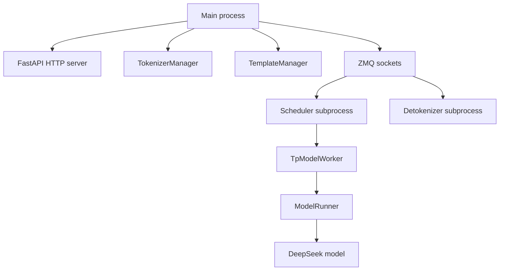

# DeepSeek 启动与模型加载链路

本文以 DeepSeek V3/V3.2 为例，说明一次服务启动从 CLI 到模型可推理的完整过程。

## 1. 启动总链路

```text
sglang serve
  -> sglang/python/sglang/cli/main.py
  -> sglang/python/sglang/cli/serve.py::serve
  -> sglang/python/sglang/launch_server.py::run_server
  -> sglang/python/sglang/srt/entrypoints/http_server.py::launch_server
  -> Engine._launch_subprocesses
  -> Scheduler subprocess
  -> TpModelWorker
  -> ModelRunner.initialize
  -> ModelRunner.load_model
  -> DefaultModelLoader.load_model
  -> DeepseekV3ForCausalLM / DeepseekV32ForCausalLM
```

`python -m sglang.launch_server` 也能启动，但代码里已经把 `sglang serve` 作为推荐入口。两者最终都会进入 `run_server(server_args)`。

## 2. CLI 到 ServerArgs

入口脚本在 `sglang/python/pyproject.toml` 中注册：

```toml
[project.scripts]
sglang = "sglang.cli.main:main"
```

LLM serving 的实际分发在 `sglang/python/sglang/cli/serve.py`：

```python
from sglang.launch_server import run_server
from sglang.srt.server_args import prepare_server_args

server_args = prepare_server_args(dispatch_argv)
run_server(server_args)
```

这里最重要的是 `prepare_server_args`。它会把 CLI 参数转换成 `ServerArgs`，例如：

- `--model-path` / `--model`
- `--tp-size` / `--tensor-parallel-size`
- `--dp-size` / `--data-parallel-size`
- `--ep-size` / `--expert-parallel-size`
- `--enable-dp-attention`
- `--attention-backend`
- `--mem-fraction-static`
- `--chunked-prefill-size`
- `--max-running-requests`
- `--cuda-graph-max-bs-decode` / `--cuda-graph-max-bs-prefill`

## 3. HTTP server 与 Engine 进程拓扑

`sglang/python/sglang/srt/entrypoints/http_server.py::launch_server` 是 SRT server 真正落地的地方。注释里已经把三个核心组件说清楚：

```python
(
    tokenizer_manager,
    template_manager,
    port_args,
    scheduler_init_result,
    subprocess_watchdog,
) = Engine._launch_subprocesses(...)

_setup_and_run_http_server(...)
```

运行时拓扑如下：



职责划分：

| 组件 | 所在进程 | 职责 |
| --- | --- | --- |
| HTTP server | 主进程 | 暴露 `/generate`、`/v1/chat/completions`、health、model info 等接口 |
| TokenizerManager | 主进程 | tokenization、请求状态、与 scheduler/detokenizer 通信 |
| Scheduler | 子进程 | 接收 tokenized request、调度 prefill/decode batch、执行模型 forward |
| DetokenizerManager | 子进程 | 将 token ids 转回文本，处理 streaming 输出 |
| ModelRunner | Scheduler 所在子进程 | 模型加载、attention backend 初始化、forward、sample |

## 4. Scheduler 子进程启动

`Engine._launch_subprocesses` 会根据 `tp/dp/pp` 启动 scheduler。如果 `dp_size == 1`，每个 pipeline/tensor rank 会启动一个 scheduler process；如果 `dp_size > 1`，会走 data parallel controller。

关键链路：

```text
Engine._launch_subprocesses
  -> _launch_scheduler_processes
  -> run_scheduler_process
  -> Scheduler(...)
  -> Scheduler.init_model_worker
  -> TpModelWorker(...)
  -> ModelRunner(...)
```

`run_scheduler_process` 做的事：

```python
scheduler = Scheduler(
    server_args,
    port_args,
    gpu_id,
    tp_rank,
    pp_rank,
    dp_rank,
    ...
)
pipe_writer.send(scheduler.get_init_info())
scheduler.run_event_loop()
```

`Scheduler.__init__` 内部重点步骤：

1. 构造 `ParallelState`，确定 TP/DP/PP/EP rank。
2. `init_model_config()`：从 `ServerArgs` 创建 `ModelConfig`。
3. `init_model_worker()`：创建 `TpModelWorker`。
4. `kv_cache_builder.build_kv_cache(...)`：构建 KV cache 与 request/token pool。
5. 初始化 schedule policy、receiver、streamer、batch result processor。
6. 进入事件循环，等待请求。

## 5. ModelRunner 初始化

`TpModelWorker` 负责创建 `ModelRunner`：

```text
TpModelWorker.__init__
  -> _init_model_config
  -> _init_model_runner
  -> ModelRunner(...)
```

`ModelRunner.__init__` 会设置分布式环境、设备、server args、模型配置，然后进入 `initialize`：

```text
ModelRunner.initialize
  -> create_sampler
  -> load_model
  -> _prepare_moe_topk
  -> init_attention_backend
  -> prepare KV pool / cuda graph / warmup related state
```

模型加载核心在 `ModelRunner.load_model`：

```python
self.loader = get_model_loader(
    load_config=self.load_config,
    model_config=self.model_config,
)
self.model = self.loader.load_model(
    model_config=self.model_config,
    device_config=self.device_config,
)
```

## 6. 从 HF config 找到 DeepSeek 类

SGLang 通过 Hugging Face config 的 `architectures` 字段决定模型类。

```text
DefaultModelLoader.load_model
  -> _initialize_model
  -> get_model_architecture(model_config)
  -> ModelRegistry.resolve_model_cls(...)
  -> DeepseekV3ForCausalLM / DeepseekV32ForCausalLM
```

对应实现文件：

```text
sglang/python/sglang/srt/models/deepseek_v2.py
```

该文件末尾注册：

```python
EntryClass = [
    DeepseekV2ForCausalLM,
    DeepseekV3ForCausalLM,
    DeepseekV32ForCausalLM,
]
```

## 7. DeepSeek 权重加载与 MLA 后处理

默认 loader 会先创建模型对象，再调用模型的 `load_weights`：

```python
model_class, _ = get_model_architecture(model_config)
model = model_class(config=model_config.hf_config, quant_config=quant_config)
model.load_weights(weights)
```

DeepSeek 的 `load_weights` 之后还有一个很关键的后处理：`deepseek_common/deepseek_weight_loader.py::post_load_weights`。

它会处理 `kv_b_proj`，核心目标是服务 MLA attention：

- 兼容 AWQ/FP8/INT8 等权重量化格式；
- 对 DeepSeek V3 这类 FP8/blockwise 权重做必要转换；
- 将 `kv_b_proj` 拆成 `w_kc` 和 `w_vc`，供 MLA decode 使用；
- 某些路径下设置 `w_scale`，供后续 BMM 或 quantized kernel 使用。

理解点：

```text
kv_b_proj.weight
  -> post_load_weights
  -> w_kc: attention score 相关
  -> w_vc: attention output 还原相关
```

这就是 DeepSeek MLA 相比普通 MHA/GQA 的关键优化之一。它让运行时可以用更小的 latent KV 表示缓存，并在 attention 前后通过投影还原计算。

## 8. Attention backend 选择

`ModelRunner.init_attention_backend` 会根据 `ServerArgs` 选择 prefill/decode backend：

```text
server_args.get_attention_backends()
  -> prefill_attention_backend_str
  -> decode_attention_backend_str
  -> ATTENTION_BACKENDS[backend_str](model_runner)
```

常见场景：

| 场景 | backend |
| --- | --- |
| NVIDIA CUDA 常规 | `triton`、`flashinfer`、`fa3`、`flashmla` 等，取决于参数和模型 |
| DeepSeek V3.2 DSA | 可能走 `flashmla_sparse`、`tilelang`、`fa3`、`aiter`、`trtllm` 等 |
| Ascend NPU | `ascend`，在 NPU 默认参数中会强制设置 |

NPU 默认参数在 `sglang/python/sglang/srt/hardware_backend/npu/utils.py`：

```python
args.attention_backend = "ascend"
args.prefill_attention_backend = "ascend"
args.decode_attention_backend = "ascend"
if args.page_size is None:
    args.page_size = 128
```

## 9. 服务 ready 之前发生了什么

启动完成不是模型对象创建完就结束。典型顺序是：

1. CLI 参数解析完成。
2. 主进程创建 IPC 端口与 ZMQ socket。
3. Scheduler 子进程启动。
4. Scheduler 内部创建 `ModelRunner` 并加载 DeepSeek 权重。
5. KV cache 与 request/token pool 初始化。
6. Detokenizer 子进程启动。
7. TokenizerManager 初始化。
8. Scheduler 向主进程返回 init info。
9. HTTP server 执行 warmup/health check。
10. 服务对外 ready。

如果启动慢，通常不是 HTTP server 慢，而是模型权重加载、分布式初始化、KV cache 分配、cuda graph 或后端 warmup 在耗时。
