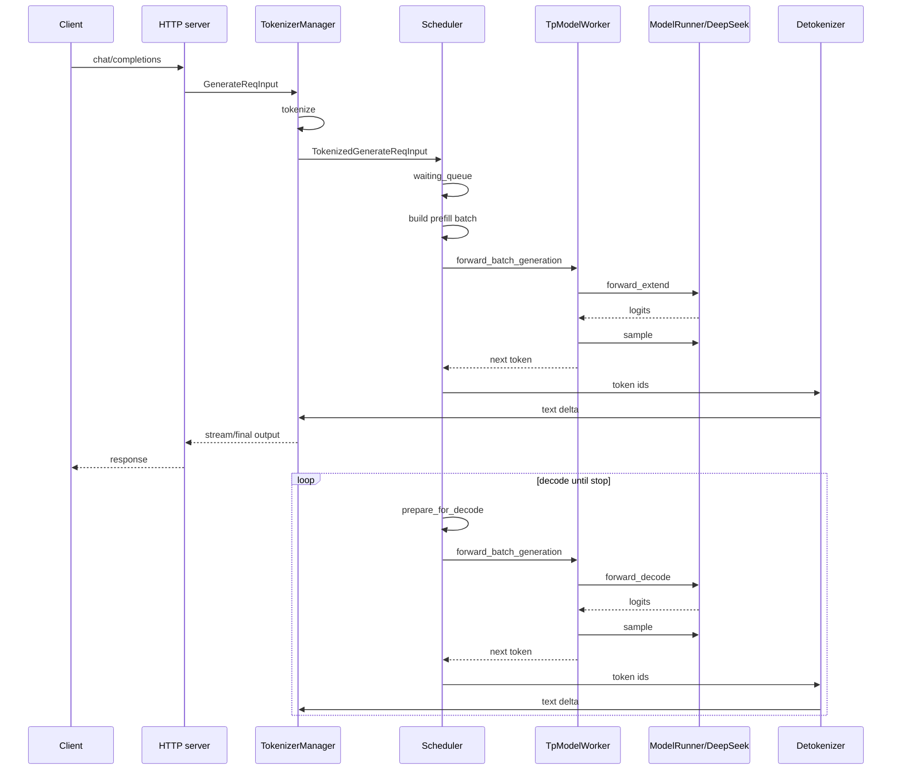

# 一次 DeepSeek 推理的完整过程

本文从用户发起一次 OpenAI-compatible 请求开始，追踪它如何变成 DeepSeek 模型的一次 prefill/decode forward，并最终返回文本。

## 1. 请求总链路

```text
POST /v1/chat/completions
  -> OpenAI serving adapter
  -> TokenizerManager.generate_request
  -> TokenizerManager._tokenize_one_request
  -> TokenizerManager._send_one_request
  -> Scheduler.handle_generate_request
  -> waiting_queue
  -> Scheduler.get_next_batch_to_run
  -> Scheduler.run_batch
  -> TpModelWorker.forward_batch_generation
  -> ForwardBatch.init_new
  -> ModelRunner.forward
  -> ModelRunner.forward_extend / forward_decode
  -> DeepseekV3ForCausalLM.forward
  -> logits_processor
  -> ModelRunner.sample
  -> DetokenizerManager
  -> TokenizerManager
  -> HTTP response / stream
```

## 2. HTTP 层：OpenAI API 到 TokenizerManager

OpenAI-compatible chat/completions 请求先在 `http_server.py` 中进入对应 handler，再由 OpenAI serving adapter 转成内部 `GenerateReqInput`。

普通 `/generate` 接口的路径更直接：

```python
async for out in _global_state.tokenizer_manager.generate_request(obj, request):
    yield b"data: " + dumps_json(out) + b"\n\n"
```

`TokenizerManager.generate_request` 负责：

- 处理 batch/single request 的兼容；
- 合并默认 sampling 参数；
- 校验 LoRA、session、grammar、tool/reasoning parser 等；
- tokenize prompt；
- 把 tokenized request 通过 ZMQ 发给 scheduler；
- 等待 scheduler/detokenizer 的返回。

发送到 scheduler 的关键动作：

```python
self.send_to_scheduler.send_pyobj(tokenized_obj)
```

## 3. Scheduler：请求入队

Scheduler 收到的是 tokenized request。核心处理在：

```text
Scheduler.process_input_requests
  -> handle_generate_request
  -> _add_request_to_queue
```

入队后的请求会进入 `waiting_queue`。调度器事件循环大致如下：

```python
while True:
    self.process_input_requests(...)
    batch = self.get_next_batch_to_run()
    if batch:
        result = self.run_batch(batch)
        self.process_batch_result(batch, result)
```

## 4. Prefill 与 Decode 的区别

一次自回归生成至少包含两类 forward：

| 阶段 | forward mode | 输入特点 | 主要工作 |
| --- | --- | --- | --- |
| Prefill | `EXTEND` | prompt token 序列，长度通常大于 1 | 计算 prompt 的 hidden states，写入 KV cache，得到首个可采样位置的 logits |
| Decode | `DECODE` | 每个请求通常只追加 1 个 token | 读取历史 KV cache，计算下一个 token 的 logits，继续循环 |

调度器会在 `get_next_batch_to_run` 中决定下一批是新 prefill，还是已有 running batch 的 decode。

```text
waiting_queue has request
  -> get_new_batch_prefill
  -> ForwardMode.EXTEND

running_batch has active request
  -> prepare_for_decode
  -> ForwardMode.DECODE
```

Decode 前，`ScheduleBatch.prepare_for_decode` 会为每个请求分配新的 KV cache 位置：

```text
alloc_for_decode(...)
  -> out_cache_loc
  -> seq_lens += 1
  -> forward_mode = DECODE
```

## 5. Scheduler.run_batch 到 ModelRunner.forward

非 overlap 的主路径可以理解为：

```text
Scheduler.run_batch
  -> resolve_forward_inputs
  -> model_worker.forward_batch_generation
  -> ForwardBatch.init_new
  -> model_runner.forward
  -> model_runner.sample
```

`TpModelWorker.forward_batch_generation` 的核心逻辑：

```python
forward_batch = ForwardBatch.init_new(batch, self.model_runner)
logits_output = self.model_runner.forward(forward_batch, ...)
batch_result.next_token_ids = self.model_runner.sample(logits_output, forward_batch)
```

`ForwardBatch.init_new` 会把调度 batch 转成模型需要的张量与元数据：

- `input_ids`
- `positions`
- `seq_lens`
- `req_pool_indices`
- `out_cache_loc`
- `sampling_info`
- `forward_mode`
- `spec_info`
- multimodal / LoRA / grammar / logprob metadata

## 6. ModelRunner.forward 分发

`ModelRunner.forward` 是模型执行统一入口。它会根据 `ForwardMode` 选择不同路径：

```text
ForwardMode.DECODE
  -> forward_decode

ForwardMode.EXTEND
  -> forward_extend

ForwardMode.IDLE
  -> forward_idle
```

`forward_extend` 主要用于 prefill：

```python
self.attn_backend.init_forward_metadata(forward_batch)
return self.model.forward(
    forward_batch.input_ids,
    forward_batch.positions,
    forward_batch,
    ...
)
```

`forward_decode` 主要用于逐 token decode：

```python
self.attn_backend.init_forward_metadata_capture_cuda_graph(...)
return self.model.forward(
    forward_batch.input_ids,
    forward_batch.positions,
    forward_batch,
    ...
)
```

差异不只在输入长度，还包括 attention metadata、KV cache block table、cuda graph capture/replay、speculative decoding 等。

## 7. DeepSeek 模型 forward 链路

DeepSeek V3/V3.2 的主实现仍在 `deepseek_v2.py`，类名按模型版本继承区分。

核心链路：

```text
DeepseekV3ForCausalLM.forward
  -> DeepseekV2Model.forward
  -> for each DeepseekV2DecoderLayer
       -> DeepseekV2AttentionMLA.forward
       -> DeepseekV2MoE.forward or dense MLP
  -> logits_processor
```

模型层级：

| 类 | 作用 |
| --- | --- |
| `DeepseekV2ForCausalLM` / `DeepseekV3ForCausalLM` / `DeepseekV32ForCausalLM` | Causal LM 外壳，接 logits processor、lm head、权重加载 |
| `DeepseekV2Model` | embedding、decoder layer 循环、final norm、PP rank 边界 |
| `DeepseekV2DecoderLayer` | attention + MLP/MoE + residual/norm |
| `DeepseekV2AttentionMLA` | MLA/MHA/DSA attention 选择与执行 |
| `DeepseekV2MoE` | gate/topk、专家执行、DeepEP/FuseEP 分支 |

## 8. DeepSeek MLA attention 关键路径

`DeepseekV2AttentionMLA` 不是简单地调用一个 attention kernel。它会先根据配置和 backend 判断 forward method：

```text
dispatch_attn_forward_method
  -> AttentionBackendRegistry.get_handler(attention_backend)
  -> AttnForwardMethod.MLA / MHA / DSA / MLA_NPU / DSA_NPU
```

常规 MLA 可以理解为三段：

```text
forward_prepare
  -> q/k/v 或 latent cache 准备
  -> rope
  -> q_nope/q_pe/k_nope/k_pe

forward_core
  -> attn_mqa(...)
  -> attention backend 读写 KV cache

output projection
  -> w_vc batch matmul
  -> o_proj
```

其中 `post_load_weights` 中生成的 `w_kc`、`w_vc` 会在 MLA decode 路径中使用：

- `w_kc`：把 query 投影到 latent key 空间，参与 score 计算；
- `w_vc`：把 attention output 从 latent value 空间还原；
- KV cache 中主要保存 latent KV，降低 cache 占用。

## 9. DeepSeek MoE 关键路径

DeepSeek 的 MoE 层大致链路：

```text
DeepseekV2MoE.forward
  -> MoEGate
  -> TopK / HashTopK
  -> FusedMoE expert runner
  -> optional token dispatcher
  -> optional DeepEP / FuseEP
  -> shared experts, if enabled
```

没有跨专家并行时，更多是本地 fused MoE kernel。开启 EP 或 A2A backend 后，会进入 token dispatch/combine 路径。

Ascend FuseEP 场景中，SGLang 会走：

```text
FusedMoE.forward
  -> hardware_backend/npu/moe/fuseep.py::forward_fuseep
  -> DeepEPBuffer.get_deepep_buffer
  -> deep_ep.Buffer.fused_deep_moe
```

## 10. 采样与返回

模型 forward 返回 `LogitsProcessorOutput` 后，最后一个 pipeline rank 会采样：

```python
next_token_ids = self.model_runner.sample(logits_output, forward_batch)
```

采样考虑：

- temperature/top-p/top-k/min-p；
- stop token / max token；
- grammar constraint；
- logprob；
- speculative decoding 验证；
- batch 内不同请求的 sampling 参数。

得到 next token 后：

```text
Scheduler.process_batch_result
  -> BatchResultProcessor
  -> DetokenizerManager
  -> TokenizerManager.rid_to_state
  -> HTTP stream or final JSON
```

如果是 streaming，请求会多次返回增量文本；如果不是 streaming，TokenizerManager 会等请求完成后返回完整结果。

## 11. 一次推理的心智模型


