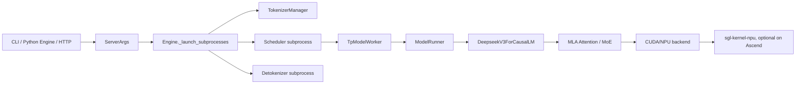

# SGLang DeepSeek 学习入口

这组文档面向当前工作根路径下的两个代码仓：

- `sglang/`：SGLang 主仓，包含服务入口、HTTP/OpenAI API、调度器、模型加载、DeepSeek 模型实现、CUDA/NPU 后端适配。
- `sgl-kernel-npu/`：Ascend NPU 内核仓，包含 DeepEP-Ascend、MLA/MoE/LoRA/KV cache 等 NPU kernel 与 PyTorch 扩展。

建议先按下面顺序阅读，不要一开始就钻进 kernel 或每个参数的细节。

## 推荐学习路线

1. `sglang/python/sglang/cli/serve.py`
   - 先看 `sglang serve` 如何转成 `ServerArgs`，再进入运行时。
2. `sglang/python/sglang/launch_server.py`
   - 理解兼容入口 `python -m sglang.launch_server` 与实际 HTTP server 入口的关系。
3. `sglang/python/sglang/srt/entrypoints/http_server.py`
   - 明确主进程职责：FastAPI、TokenizerManager、OpenAI API 适配、warmup。
4. `sglang/python/sglang/srt/entrypoints/engine.py`
   - 这是最好的运行时切入点：TokenizerManager、Scheduler、Detokenizer 的进程拓扑都在这里成形。
5. `sglang/python/sglang/srt/managers/scheduler.py`
   - 学习请求如何排队、prefill/decode 如何组 batch、什么时候调用模型。
6. `sglang/python/sglang/srt/model_executor/model_runner.py`
   - 学习模型加载、attention backend 初始化、forward/sample 的统一入口。
7. `sglang/python/sglang/srt/models/deepseek_v2.py`
   - DeepSeek V2/V3/V3.2 的核心模型实现，重点看 MLA attention、MoE、weight load 后处理。
8. `sglang/python/sglang/srt/hardware_backend/npu/`
   - 如果关注 Ascend，继续看 NPU attention/MoE 如何接入。
9. `sgl-kernel-npu/python/deep_ep/` 与 `sgl-kernel-npu/csrc/`
   - 最后再看 DeepEP/FuseEP 和自定义 NPU kernel。

## 文档索引

- [01_repo_map_and_learning_path.md](01_repo_map_and_learning_path.md)
  - 两个仓的职责边界、读代码顺序、关键文件地图。
- [02_deepseek_startup_and_loading.md](02_deepseek_startup_and_loading.md)
  - DeepSeek 服务启动、进程拉起、模型配置、权重加载、attention backend 初始化。
- [03_deepseek_request_inference_flow.md](03_deepseek_request_inference_flow.md)
  - 一次推理请求从 HTTP 到 tokenizer、scheduler、prefill/decode、DeepSeek forward、采样和返回的完整过程。
- [04_npu_kernel_bridge.md](04_npu_kernel_bridge.md)
  - SGLang 如何接到 `sgl-kernel-npu`，包括 MLA preprocess、batch matmul transpose、FuseEP/DeepEP。
- [05_startup_demos_and_best_practices.md](05_startup_demos_and_best_practices.md)
  - 不同启动入口的 demo，以及 DeepSeek 场景的 CLI 参数实践。

## 一句话总览

