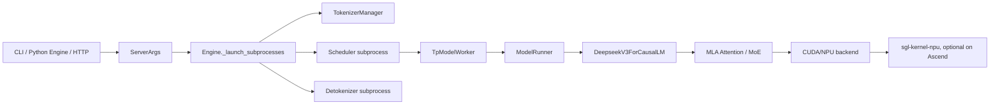

# SGLang DeepSeek 学习入口

这组文档面向当前工作根路径下的两个代码仓：

- `sglang/`：SGLang 主仓，包含服务入口、HTTP/OpenAI API、调度器、模型加载、DeepSeek 模型实现、CUDA/NPU 后端适配。
- `sgl-kernel-npu/`：Ascend NPU 内核仓，包含 DeepEP-Ascend、MLA/MoE/LoRA/KV cache 等 NPU kernel 与 PyTorch 扩展。

建议先按下面顺序阅读，不要一开始就钻进 kernel 或每个参数的细节。

## 文档索引

| 顺序 | 文档 | 内容 |
| --- | --- | --- |
| 1 | [两仓职责与最佳切入点](deepseek_inference/01_repo_map_and_learning_path) | 两个仓的职责边界、读代码顺序、关键文件地图 |
| 2 | [DeepSeek 启动与模型加载链路](deepseek_inference/02_deepseek_startup_and_loading) | DeepSeek 服务启动、进程拉起、模型配置、权重加载、attention backend 初始化 |
| 3 | [一次 DeepSeek 推理的完整过程](deepseek_inference/03_deepseek_request_inference_flow) | 一次推理请求从 HTTP 到 tokenizer、scheduler、prefill/decode、DeepSeek forward、采样和返回的完整过程 |
| 4 | [Ascend NPU 与 sgl-kernel-npu 桥接链路](deepseek_inference/04_npu_kernel_bridge) | SGLang 如何接到 `sgl-kernel-npu`，包括 MLA preprocess、batch matmul transpose、FuseEP/DeepEP |
| 5 | [DeepSeek 启动 Demo 与参数实践](deepseek_inference/05_startup_demos_and_best_practices) | 不同启动入口的 demo，以及 DeepSeek 场景的 CLI 参数实践 |

## 推荐学习路线

1. `sglang/python/sglang/cli/serve.py`
2. `sglang/python/sglang/launch_server.py`
3. `sglang/python/sglang/srt/entrypoints/http_server.py`
4. `sglang/python/sglang/srt/entrypoints/engine.py`
5. `sglang/python/sglang/srt/managers/scheduler.py`
6. `sglang/python/sglang/srt/model_executor/model_runner.py`
7. `sglang/python/sglang/srt/models/deepseek_v2.py`
8. `sglang/python/sglang/srt/hardware_backend/npu/`
9. `sgl-kernel-npu/python/deep_ep/` 与 `sgl-kernel-npu/csrc/`

## 一句话总览

