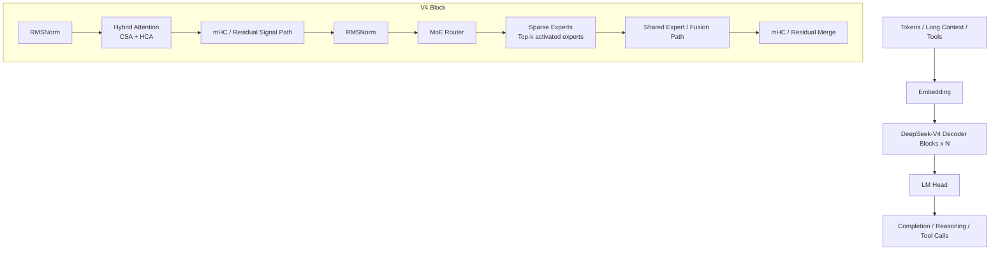

# DeepSeek-V4-Pro 架构

分析时间：`2026-06-13 20:37:49 CST`

## 官方定位

DeepSeek 官网当前提示 `DeepSeek-V4` 预览版本已经上线网页端、App 和 API；DeepSeek API 文档列出 `deepseek-v4-flash` 与 `deepseek-v4-pro` 两个模型版本，并说明它们支持 non-thinking 与 thinking 模式，context length 为 `1M`，最大输出 `384K`。

Hugging Face 官方模型卡将 DeepSeek-V4 系列描述为两个强 MoE 语言模型：

| 模型 | 总参数 | 激活参数 | 上下文 | 精度 |
| --- | --- | --- | --- | --- |
| DeepSeek-V4-Flash | 284B | 13B | 1M | FP4 + FP8 Mixed |
| DeepSeek-V4-Pro | 1.6T | 49B | 1M | FP4 + FP8 Mixed |
| DeepSeek-V4-Flash-Base | 284B | 13B | 1M | FP8 Mixed |
| DeepSeek-V4-Pro-Base | 1.6T | 49B | 1M | FP8 Mixed |

说明：FP4 + FP8 Mixed 中，MoE expert 参数使用 FP4，多数其他参数使用 FP8。

## 核心特征

| 特征 | 解读 |
| --- | --- |
| MoE 大模型 | Pro 版本总参数 1.6T，每 token 激活 49B，通过稀疏专家降低单 token 计算量 |
| 1M 上下文 | 官方 API 与模型卡都标注 1M context length，核心价值是长文档、长对话、长链路 agent 任务 |
| Hybrid Attention | 结合 Compressed Sparse Attention 和 Heavily Compressed Attention，用于提升百万 token 下的注意力效率 |
| mHC | Manifold-Constrained Hyper-Connections，用于增强层间信号传播稳定性和表达能力 |
| Muon Optimizer | 训练优化器升级，目标是更快收敛与更稳定训练 |
| Post-training | 两阶段范式：先通过 SFT/RL-GRPO 独立培养领域专家，再通过 on-policy distillation 做统一整合 |
| Reasoning effort | 支持 Non-think、Think、Think Max 三类推理努力模式 |

## 架构图



## 模型解构说明

### 1. Token 与长上下文输入

DeepSeek-V4 面向 1M context。这个长度会把传统全注意力的计算和 KV cache 压力推到很高，因此 V4 的结构重点不是单纯加大窗口，而是配合混合注意力和压缩机制降低长上下文推理成本。

### 2. Hybrid Attention

官方模型卡给出的 V4 关键升级是 Hybrid Attention Architecture，组合：

- `CSA`：Compressed Sparse Attention，偏向“只在重要 token 上保留更高注意力分辨率”。
- `HCA`：Heavily Compressed Attention，偏向“对大范围历史上下文做更强压缩”。

从推理视角看，它的目标是把 1M 上下文中的“全量历史”拆成高价值稀疏部分与低成本压缩部分，减少单 token decode 阶段 FLOPs 和 KV cache。

### 3. MoE 专家层

DeepSeek-V4-Pro 是 MoE 模型。每个 token 不激活全部 1.6T 参数，而是通过 router 选择部分专家，实际激活约 49B 参数。这个设计把“模型容量”和“单 token 计算成本”拆开：容量来自大量专家，成本来自 top-k 激活。

### 4. mHC 连接

mHC 是 DeepSeek-V4 的新结构特征。它不是普通 residual connection 的简单替代，而是加强层间信号传播稳定性的连接机制。对超深、超大 MoE 模型来说，这类连接的价值在于缓解训练时信号衰减、层间表达不稳和大规模优化难度。

### 5. Reasoning effort 模式

官方模型卡把推理努力分为三档：

| 模式 | 适用场景 | 输出形态 |
| --- | --- | --- |
| Non-think | 日常任务、低风险决策、快速响应 | 直接给摘要或答案 |
| Think | 复杂问题、规划、逻辑分析 | 生成 thinking 内容后给摘要 |
| Think Max | 探索模型推理边界、难题、竞赛级任务 | 更高预算推理 |

API 文档中还说明旧的 `deepseek-chat` 与 `deepseek-reasoner` 会在 `2026/07/24 15:59 UTC` 废弃，兼容映射到 `deepseek-v4-flash` 的非思考和思考模式。

## SGLang 工程映射

当前本地 SGLang 已包含 DeepSeek V4 专用模型实现：

| 路径 | 作用 |
| --- | --- |
| `sglang/python/sglang/srt/models/deepseek_v4.py` | DeepSeek V4 主模型实现，导入 `DeepSeekV4Config`、DSA/DSV4 相关 compressor/indexer、mHC、MoE 等 |
| `sglang/python/sglang/srt/models/deepseek_v4_nextn.py` | DeepSeek V4 NextN/MTP 相关实现 |
| `sglang/python/sglang/srt/configs/deepseek_v4.py` | DeepSeek V4 配置 |
| `sglang/python/sglang/srt/layers/attention/dsv4/` | DeepSeek V4 attention 相关 compressor/indexer 实现 |
| `sglang/python/sglang/srt/layers/mhc.py` | mHC 相关层实现 |

DeepSeek V4 模型文件中能看到这些核心依赖：

```python
from sglang.srt.configs.deepseek_v4 import DeepSeekV4Config
from sglang.srt.layers.attention.dsv4.compressor import Compressor
from sglang.srt.layers.attention.dsv4.indexer import C4Indexer
from sglang.srt.layers.layernorm import RMSNorm
from sglang.srt.layers.mhc import mhc_fused_post_pre
from sglang.srt.layers.moe.fused_moe_triton import FusedMoE
```

DeepSeek V4 复用 DeepSeek V2/V3 MoE 体系，但在 router/top-k 上有 V4 专门逻辑：

```python
if is_deepseek_v4:
    topk_kwargs.update(
        use_grouped_topk=False,
        scoring_func=config.scoring_func,
        is_fp4_experts=getattr(quant_config, "is_fp4_experts", False),
    )
```

## 官方资料

- [DeepSeek 官网](https://www.deepseek.com/)
- [DeepSeek API Models & Pricing](https://api-docs.deepseek.com/quick_start/pricing)
- [DeepSeek-V4-Pro Hugging Face 模型卡](https://huggingface.co/deepseek-ai/DeepSeek-V4-Pro)
- [DeepSeek_V4.pdf 技术报告](https://huggingface.co/deepseek-ai/DeepSeek-V4-Pro/blob/main/DeepSeek_V4.pdf)
