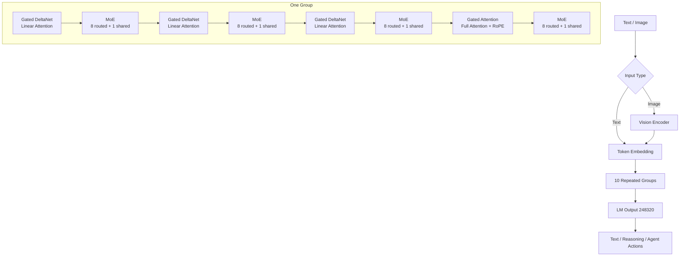

# Qwen3.6-35B-A3B 架构

分析时间：`2026-06-13 20:37:49 CST`

## 官方定位

QwenLM 官方 GitHub 将 `Qwen3.6` 描述为 Qwen 模型家族的最新补充，构建在 Qwen3.5 的突破之上，优先强调稳定性、真实世界可用性、agentic coding 和 thinking preservation。

`Qwen3.6-35B-A3B` 的 Hugging Face 官方模型卡说明：该仓库包含 Hugging Face Transformers 格式的 post-trained 权重和配置文件，兼容 Transformers、vLLM、SGLang、KTransformers 等。

## 核心参数

| 项 | 数值 |
| --- | --- |
| 类型 | Causal Language Model with Vision Encoder |
| 参数量 | 35B total，3B activated |
| 层数 | 40 |
| Hidden Dimension | 2048 |
| Token Embedding | 248320 padded |
| Hidden Layout | 10 × (3 × (Gated DeltaNet → MoE) → 1 × (Gated Attention → MoE)) |
| Gated DeltaNet | 32 个 V linear attention heads，16 个 QK heads，head dim 128 |
| Gated Attention | 16 个 Q heads，2 个 KV heads，head dim 256，RoPE dim 64 |
| MoE | 256 experts，每 token 激活 8 routed + 1 shared |
| Expert Intermediate Dimension | 512 |
| MTP | trained with multi-steps |
| Context Length | 原生 262,144 tokens，可扩展到 1,010,000 tokens |

## 架构图

Qwen3.6-35B-A3B 的关键不是简单重复全注意力层，而是把 40 层组织成 10 个大组，每组 4 层：前 3 层为 Gated DeltaNet 线性注意力层，第 4 层为 Gated Attention 全注意力层，每层后接 MoE。



## 模型解构说明

### 1. Vision Encoder + Causal LM

模型类型是 `Causal Language Model with Vision Encoder`。文本输入进入 token embedding；图像输入先经过视觉编码器，再被映射/合并到语言模型序列中。这使它既能做语言任务，也能做视觉语言任务。

### 2. Gated DeltaNet 层

Gated DeltaNet 是线性注意力路线，用于降低长上下文推理成本。模型卡给出每层的线性注意力头配置：V heads 为 32，QK heads 为 16，head dim 为 128。

从结构上看，Qwen3.6 不是完全舍弃全注意力，而是用 3 层 Gated DeltaNet 吸收大部分长序列计算，再周期性插入 Gated Attention 保持全局交互能力。

### 3. Gated Attention 层

每 4 层中的第 4 层是 Gated Attention。官方模型卡给出 16 个 Q heads、2 个 KV heads、head dim 256、RoPE dim 64。它承担更强的全局 token 交互和位置建模。

### 4. MoE 层

每层 attention/linear attention 后接 MoE。模型卡说明共有 256 个专家，每 token 激活 `8 routed + 1 shared`，expert intermediate dimension 为 512。这个结构让模型保留大量专家容量，同时把单 token 激活参数控制在 3B。

### 5. MTP 与长上下文

模型卡写明 MTP trained with multi-steps，并支持原生 262K context，可扩展到 1.01M。MTP 更偏向训练/推理效率与多步预测能力，长上下文则依赖 Gated DeltaNet、周期性全注意力以及运行时系统对 KV/cache 的支撑。

## SGLang 工程映射

当前本地 SGLang 没有单独命名 `qwen3_6.py`，但已经包含 Qwen3.5/Qwen3 系列所需结构。Qwen3.6-35B-A3B 与 Qwen3.5 的混合线性注意力、MoE、VL 结构高度相关，主要对应以下实现：

| 路径 | 作用 |
| --- | --- |
| `sglang/python/sglang/srt/models/qwen3_5.py` | Qwen3.5 / Qwen3.5 MoE / VL 相关主实现，包含 GatedDeltaNet、LinearDecoderLayer、AttentionDecoderLayer |
| `sglang/python/sglang/srt/models/qwen3_moe.py` | Qwen3 MoE 基础实现 |
| `sglang/python/sglang/srt/models/qwen3_vl.py` | Qwen3-VL 视觉语言模型实现 |
| `sglang/python/sglang/srt/models/qwen3_next.py` | Qwen3-Next hybrid linear attention 实现 |
| `sglang/python/sglang/srt/models/qwen3_5_mtp.py` | Qwen3.5 MTP 相关实现 |

SGLang 中 Qwen3.5 的线性注意力层可以看到 GatedDeltaNet 的核心字段：

```python
class Qwen3_5GatedDeltaNet(nn.Module):
    def __init__(self, config: Qwen3_5TextConfig, layer_id: int, ...):
        self.num_v_heads = config.linear_num_value_heads
        self.num_k_heads = config.linear_num_key_heads
        self.head_k_dim = config.linear_key_head_dim
        self.head_v_dim = config.linear_value_head_dim
        self.conv_kernel_size = config.linear_conv_kernel_dim
        self.in_proj_qkvz = self.create_qkvz_proj(...)
        self.in_proj_ba = self.create_ba_proj(...)
```

混合层在 SGLang 中拆成两类 decoder layer：

```python
class Qwen3_5LinearDecoderLayer(nn.Module):
    """Qwen3.5 Decoder Layer with Linear Attention (GatedDeltaNet)."""

class Qwen3_5AttentionDecoderLayer(nn.Module):
    """Qwen3.5 Decoder Layer with Full Attention."""
```

MoE 分支根据 `model_type` 决定是 dense MLP 还是 sparse MoE：

```python
if config.model_type == "qwen3_5_moe_text":
    self.mlp = Qwen2MoeSparseMoeBlock(...)
elif config.model_type == "qwen3_5_text":
    self.mlp = Qwen2MoeMLP(...)
```

## 官方资料

- [QwenLM/Qwen3.6 GitHub](https://github.com/QwenLM/Qwen3.6)
- [Qwen3.6-35B-A3B Hugging Face 模型卡](https://huggingface.co/Qwen/Qwen3.6-35B-A3B)
- [Qwen 文档站](https://qwen.readthedocs.io/en/latest/)
- [Qwen3.6-35B-A3B 官方博客入口](https://qwen.ai/blog?id=qwen3.6-35b-a3b)
