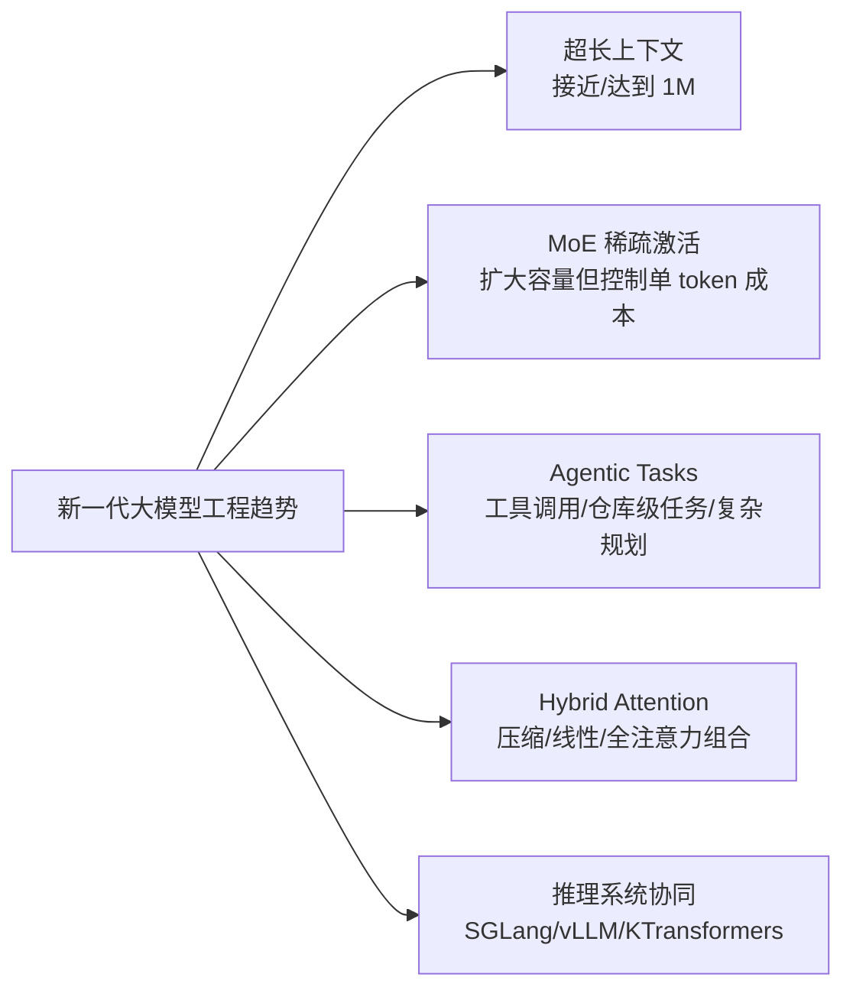

# 架构对比与资料

分析时间：`2026-06-13 20:37:49 CST`

## 横向对比

| 维度 | DeepSeek-V4-Pro | Qwen3.6-35B-A3B |
| --- | --- | --- |
| 官方家族 | DeepSeek V4 preview | Qwen3.6 |
| 代表定位 | DeepSeek V4 高能力 MoE 语言模型 | Qwen3.6 开源 MoE/VL 代表模型 |
| 模型类型 | MoE language model | Causal LM with Vision Encoder |
| 参数规模 | 1.6T total，49B activated | 35B total，3B activated |
| 上下文 | 1M | 262K native，可扩展到 1.01M |
| 注意力路线 | Hybrid Attention：CSA + HCA | 3 层 Gated DeltaNet + 1 层 Gated Attention 周期组合 |
| 专家结构 | MoE，官方公开总/激活参数，细粒度专家数需看技术报告 | 256 experts，8 routed + 1 shared |
| 训练/优化亮点 | mHC、Muon optimizer、SFT/RL-GRPO、on-policy distillation | Gated DeltaNet、Gated Attention、MoE、MTP、thinking preservation |
| 推理模式 | Non-think、Think、Think Max | 模型卡强调 agentic coding、thinking preservation；Qwen 文档整体有 thinking/non-thinking 路线 |
| 多模态 | V4-Pro 模型卡聚焦 text generation | 官方模型类型包含 Vision Encoder，模型卡含 Vision Language benchmark |
| SGLang 代码映射 | `deepseek_v4.py`、`deepseek_v4_nextn.py`、`layers/attention/dsv4/`、`layers/mhc.py` | `qwen3_5.py`、`qwen3_moe.py`、`qwen3_vl.py`、`qwen3_next.py`、`qwen3_5_mtp.py` |

## 共同趋势



## 架构理解

### DeepSeek 的路线

DeepSeek-V4-Pro 走的是“超大 MoE + 百万上下文效率优化”路线。MoE 提供模型容量，Hybrid Attention 面向长上下文压缩，mHC 和 Muon 优化器服务于训练稳定性，reasoning effort 模式服务于推理预算分层。

适合重点关注：

- 长上下文推理成本。
- MoE 专家并行、FP4/FP8 混合精度。
- Agent 任务中工具调用和长历史保持。
- SGLang 中 DeepSeek V4 attention/cache/DSV4/mHC 的实现。

### Qwen 的路线

Qwen3.6-35B-A3B 走的是“混合线性注意力 + 周期全注意力 + MoE + 多模态”的路线。它的层布局非常清晰：每组 3 个 Gated DeltaNet 层降低长上下文成本，再接 1 个 Gated Attention 层保留全局交互，每层后接 MoE 扩展容量。

适合重点关注：

- Gated DeltaNet 如何支撑长上下文。
- 周期性全注意力层如何补足线性注意力表达能力。
- 8 routed + 1 shared expert 的 MoE 激活模式。
- Vision Encoder 如何和语言模型序列融合。
- SGLang 中 Qwen3.5/Qwen3/VL/MTP 代码的复用关系。

## 一句话对比

- DeepSeek-V4-Pro：更像“容量极大、压缩注意力更强、面向百万上下文和推理预算分层的 MoE 旗舰”。
- Qwen3.6-35B-A3B：更像“层布局更结构化、线性注意力和全注意力组合、多模态和 coding/agent 更直接面向开发者场景的 MoE 模型”。

## 官方详细资料

| 类型 | DeepSeek | Qwen |
| --- | --- | --- |
| 官网 | [DeepSeek](https://www.deepseek.com/) | [Qwen](https://qwen.ai/) |
| API/文档 | [DeepSeek API Docs](https://api-docs.deepseek.com/quick_start/pricing) | [Qwen Docs](https://qwen.readthedocs.io/en/latest/) |
| GitHub | [deepseek-ai](https://github.com/deepseek-ai) | [QwenLM/Qwen3.6](https://github.com/QwenLM/Qwen3.6) |
| Hugging Face 模型卡 | [DeepSeek-V4-Pro](https://huggingface.co/deepseek-ai/DeepSeek-V4-Pro) | [Qwen3.6-35B-A3B](https://huggingface.co/Qwen/Qwen3.6-35B-A3B) |
| 技术报告/详细说明 | [DeepSeek_V4.pdf](https://huggingface.co/deepseek-ai/DeepSeek-V4-Pro/blob/main/DeepSeek_V4.pdf) | [Qwen3.6-35B-A3B Blog](https://qwen.ai/blog?id=qwen3.6-35b-a3b)、[Qwen3 Technical Report](https://arxiv.org/abs/2505.09388) |

## 本地继续追踪命令

查 DeepSeek V4 相关实现：

```bash
rg -n "DeepSeekV4|deepseek_v4|mHC|Compressor|C4Indexer|is_deepseek_v4" \
  sglang/python/sglang/srt
```

查 Qwen3.6 可能复用的 Qwen3.5/Qwen3/VL/MTP 实现：

```bash
rg -n "Qwen3_5|Qwen3Moe|Qwen3VL|GatedDeltaNet|MTP|linear_attention" \
  sglang/python/sglang/srt/models \
  sglang/python/sglang/srt/configs
```

查文档中对 DeepSeek V4 和 Qwen3.x 的使用说明：

```bash
rg -n "DeepSeek-V4|Qwen3.6|Qwen3.5|Qwen3-VL|Qwen3-Next" \
  sglang/docs_new sglang/docs
```
