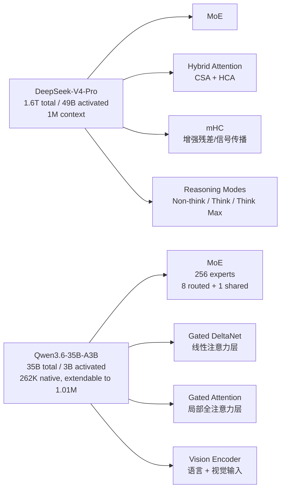

# DeepSeek 与 Qwen 最新模型架构学习笔记

分析时间：`2026-06-13 20:37:49 CST`

归档标识：`deepseek_qwen_model_architecture_20260613_203749`

## 选型口径

本次按官方最新公开资料选择两个代表模型：

- DeepSeek：`DeepSeek-V4-Pro`，代表 DeepSeek V4 预览系列的高能力 MoE 模型。官方 API 当前列出 `deepseek-v4-pro` 与 `deepseek-v4-flash`。
- Qwen：`Qwen3.6-35B-A3B`，代表 Qwen3.6 家族中官方模型卡披露架构参数较完整的开源 MoE/VL 模型。Qwen3.6 家族中 `Qwen3.6-27B` 发布时间更晚，但 `35B-A3B` 更适合做 MoE 架构解构。

## 快速结论

- DeepSeek-V4-Pro 是大规模 MoE 语言模型，重点放在百万 token 长上下文、混合注意力、mHC 残差增强、Muon 优化器和多 reasoning effort 模式。
- Qwen3.6-35B-A3B 是带 Vision Encoder 的因果语言模型，采用 Gated DeltaNet、Gated Attention、MoE 交替堆叠，更强调 agentic coding、thinking preservation、视觉语言能力与超长上下文。
- 两者都在向“长上下文 + Agent + 工程可部署”收敛，但路线不同：DeepSeek 更强调 MoE 规模和百万上下文推理效率，Qwen3.6 更强调混合线性注意力/全注意力层布局、多模态入口和开发者工作流。
- 当前 SGLang 本地源码已包含 `deepseek_v4.py`、`deepseek_v4_nextn.py`、`qwen3_5.py`、`qwen3_moe.py`、`qwen3_vl.py`、`qwen3_next.py` 等实现，能看出项目已在跟进 DeepSeek V4 与 Qwen3.x 系列的新结构。

## 文档索引

| 文档 | 内容 |
| --- | --- |
| [01_deepseek_v4_architecture.md](01_deepseek_v4_architecture.md) | DeepSeek-V4-Pro 的模型特征、架构图、解构说明、SGLang 映射 |
| [02_qwen36_architecture.md](02_qwen36_architecture.md) | Qwen3.6-35B-A3B 的模型特征、架构图、解构说明、SGLang 映射 |
| [03_architecture_comparison.md](03_architecture_comparison.md) | DeepSeek 与 Qwen 的架构对比、选型理解、官方资料汇总 |

## 官方资料

| 模型 | 官方资料 |
| --- | --- |
| DeepSeek-V4-Pro | [DeepSeek 官网](https://www.deepseek.com/)、[DeepSeek API Models & Pricing](https://api-docs.deepseek.com/quick_start/pricing)、[DeepSeek-V4-Pro Hugging Face 模型卡](https://huggingface.co/deepseek-ai/DeepSeek-V4-Pro)、[DeepSeek_V4.pdf 技术报告](https://huggingface.co/deepseek-ai/DeepSeek-V4-Pro/blob/main/DeepSeek_V4.pdf) |
| Qwen3.6-35B-A3B | [QwenLM/Qwen3.6 GitHub](https://github.com/QwenLM/Qwen3.6)、[Qwen3.6-35B-A3B Hugging Face 模型卡](https://huggingface.co/Qwen/Qwen3.6-35B-A3B)、[Qwen 文档站](https://qwen.readthedocs.io/en/latest/)、[Qwen 官网博客入口](https://qwen.ai/blog?id=qwen3.6-35b-a3b) |

## 总览图

## 本次验证边界

- 已联网确认最新官方模型页面与官方文档入口。
- 已读取当前项目本地 SGLang 模型实现文件，建立工程映射。
- 未下载模型权重，未在 GPU/NPU 上启动实际推理服务。
