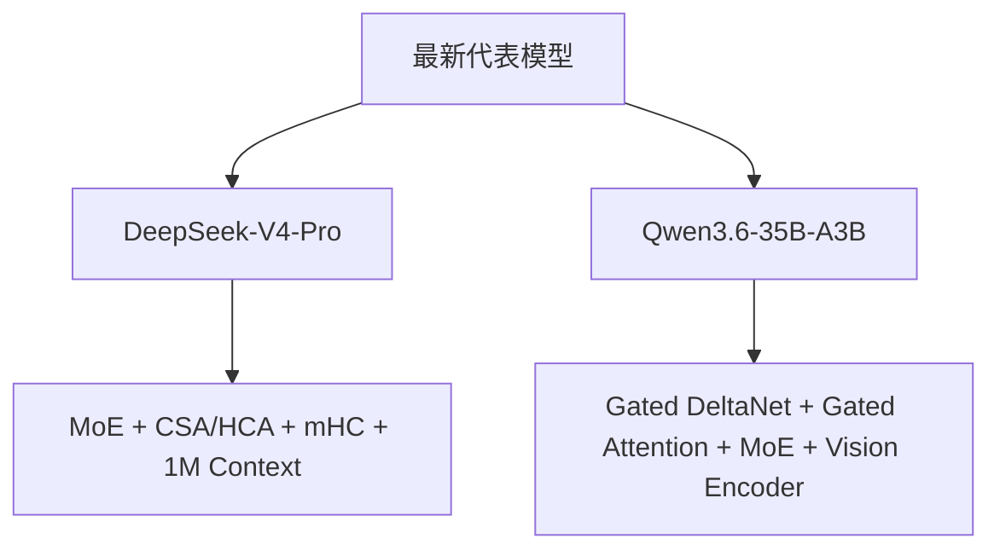

# DeepSeek 与 Qwen 最新模型架构

分析时间：`2026-06-13 20:37:49 CST`

本场景选取 `DeepSeek-V4-Pro` 与 `Qwen3.6-35B-A3B` 做对照学习。DeepSeek 代表大规模 MoE、百万 token 上下文和 V4 混合注意力路线；Qwen 代表 Qwen3.6 的混合线性注意力/全注意力、MoE、视觉语言与 agentic coding 路线。

## 阅读入口

| 文档 | 内容 |
| --- | --- |
| [DeepSeek-V4-Pro 架构](deepseek_qwen_model_architecture_20260613_203749/01_deepseek_v4_architecture) | 模型特征、架构图、解构说明、SGLang 映射 |
| [Qwen3.6-35B-A3B 架构](deepseek_qwen_model_architecture_20260613_203749/02_qwen36_architecture) | 模型特征、架构图、解构说明、SGLang 映射 |
| [架构对比与资料](deepseek_qwen_model_architecture_20260613_203749/03_architecture_comparison) | 双模型横向比较、选型理解、官方链接 |

