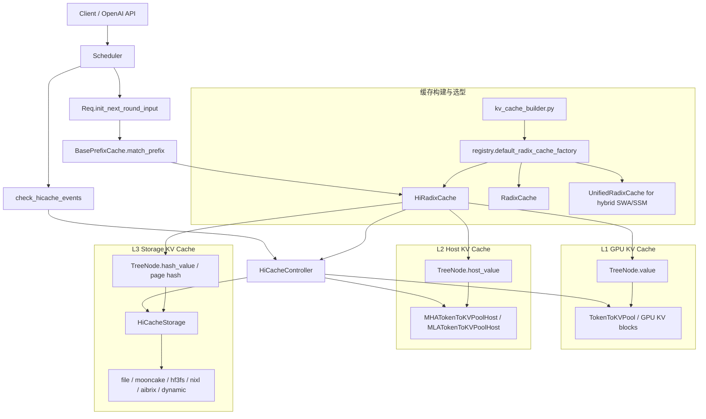
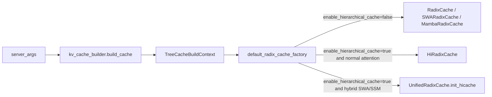
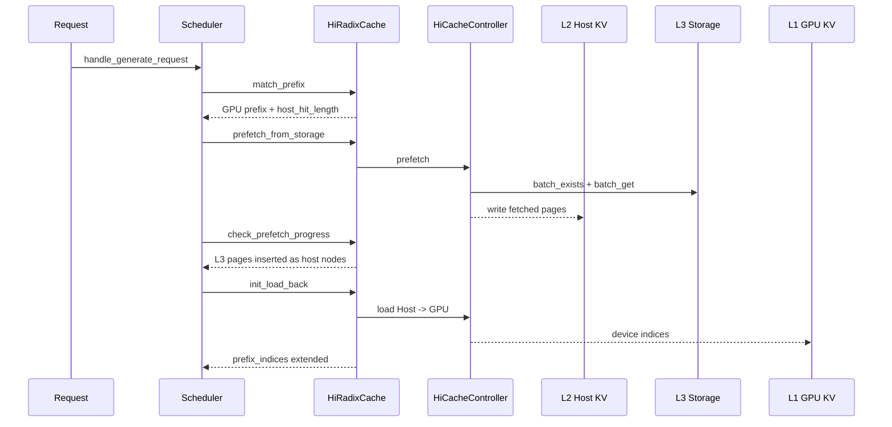
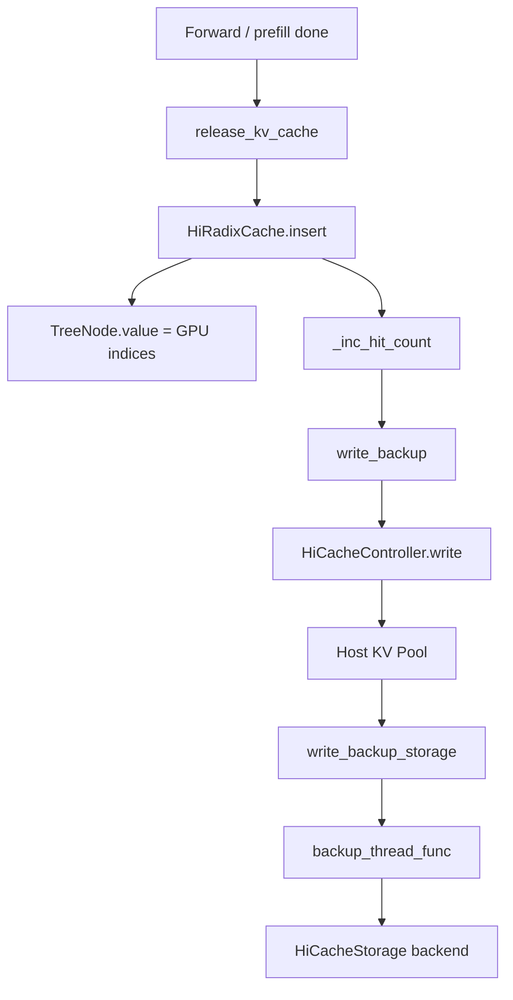

# SGLang 多级 PrefixCache 架构

## 一句话定位

SGLang 的多级 PrefixCache 是在 `RadixCache` 之上实现的 `HiRadixCache`。它把 Prefix KV 的复用从 GPU 显存扩展到 Host 内存和外部存储，使长上下文、多轮对话、共享系统提示词等场景可以在 GPU 显存不足时继续复用历史 KV。

需要区分两个概念：

- `RadixCache`：SGLang 默认的 GPU PrefixCache，核心是 RadixTree + GPU KV 索引。
- `HiCache`：Hierarchical Cache，多级 PrefixCache。它复用 RadixTree 结构，同时增加 Host KV、Storage KV、异步传输和后台预取。

## 总体架构图



## 三层缓存职责

| 层级 | 介质 | 元数据位置 | 数据位置 | 主要职责 |
| --- | --- | --- | --- | --- |
| L1 | GPU 显存 | `TreeNode.value` | `TokenToKVPool` | 直接参与 attention 计算，命中后可直接作为 `prefix_indices` |
| L2 | Host 内存 | `TreeNode.host_value` | `TokenToKVPoolHost` | GPU KV 被驱逐后仍保留可复用副本，需要 load back |
| L3 | 文件或分布式存储 | `TreeNode.hash_value` 和实时 storage query | `HiCacheStorage` 后端 | 跨请求、跨实例或大容量保存 KV page，需要 prefetch 到 Host |

`TreeNode` 是理解多级 PrefixCache 的关键入口。普通 `RadixCache` 主要依赖 `value`；HiCache 增加了 Host 和 Storage 维度：

- `value is not None`：节点在 GPU 上可直接命中。
- `host_value is not None`：节点在 Host 上有备份，即使 GPU 被 evict 也可以回填。
- `hash_value`：节点对应的 page hash，用于查询或写入 L3 Storage。
- `evicted`：源码语义是 `value is None`。
- `backuped`：源码语义是 `host_value is not None`。

## 核心组件

| 组件 | 路径 | 角色 |
| --- | --- | --- |
| `BasePrefixCache` | `sglang/python/sglang/srt/mem_cache/base_prefix_cache.py` | Scheduler 面向的统一抽象，定义 match、insert、evict 等接口 |
| `RadixCache` | `sglang/python/sglang/srt/mem_cache/radix_cache.py` | 基础 PrefixCache，维护 RadixTree 和 GPU KV block 索引 |
| `HiRadixCache` | `sglang/python/sglang/srt/mem_cache/hiradix_cache.py` | 多级 PrefixCache 主体，实现 Host/L3 预取、回填、备份 |
| `HiCacheController` | `sglang/python/sglang/srt/managers/cache_controller.py` | CPU/GPU/Storage 传输控制器，管理队列、流、后台线程 |
| `HostKVCache` | `sglang/python/sglang/srt/mem_cache/memory_pool.py` | Host KV 内存池抽象 |
| `HiCacheStorage` | `sglang/python/sglang/srt/mem_cache/hicache_storage.py` | L3 存储后端接口 |
| `StorageBackendFactory` | `sglang/python/sglang/srt/mem_cache/storage/backend_factory.py` | 注册和创建 file、mooncake、hf3fs、nixl 等后端 |

## 启动选型链路

`--enable-hierarchical-cache` 是进入 HiCache 的核心开关。缓存实例由 `kv_cache_builder.py` 组装参数，再通过 `registry.py` 选择具体实现。



核心源码入口：

- `sglang/python/sglang/srt/mem_cache/kv_cache_builder.py`
- `sglang/python/sglang/srt/mem_cache/registry.py:77`
- `sglang/python/sglang/srt/mem_cache/hiradix_cache.py:72`

## 一次请求里的读路径

读路径可以拆成三个阶段：

1. **本地树匹配**：`match_prefix` 在 RadixTree 上匹配 token page，返回 L1 GPU 命中的 `device_indices` 和 L2 Host 命中的长度。
2. **L3 预取**：请求进入 waiting queue 前，调度器根据本地匹配结果，对后续 token page 查询 L3 Storage，异步把命中的 KV page 拉到 Host。
3. **Host 回填**：请求真正进入 prefill batch 前，如果存在 Host 命中，`init_load_back` 把 Host KV 分配并传回 GPU，扩展 `prefix_indices`。



## 写入与淘汰路径

写入路径由请求完成或中间阶段缓存触发，入口仍然是统一的 PrefixCache API：

1. `cache_finished_req` 或 `cache_unfinished_req` 调用树缓存的 `insert`。
2. `HiRadixCache.insert` 把 GPU KV block 写入 RadixTree 节点。
3. 根据写策略触发 Host 备份：
   - `write_through`：尽快写 Host。
   - `write_through_selective`：按命中阈值选择性写 Host。
   - `write_back`：通常等驱逐或必要时再备份。
4. 如果启用 L3 Storage，Host 上的 KV page 会继续通过后台 backup 线程写入存储后端。



## 参数配置与最佳实践入口

基础启用：

```bash
SGLANG_HICACHE_FILE_BACKEND_STORAGE_DIR=/tmp/sglang_hicache \
python3 -m sglang.launch_server \
  --model-path /path/to/model \
  --host 0.0.0.0 \
  --port 30000 \
  --page-size 64 \
  --enable-hierarchical-cache \
  --hicache-ratio 2 \
  --hicache-write-policy write_through \
  --hicache-io-backend kernel \
  --hicache-mem-layout layer_first
```

启用 L3 Storage 的示例：

```bash
python3 -m sglang.launch_server \
  --model-path /path/to/model \
  --host 0.0.0.0 \
  --port 30000 \
  --page-size 64 \
  --enable-hierarchical-cache \
  --hicache-ratio 2 \
  --hicache-write-policy write_through \
  --hicache-storage-backend file \
  --hicache-storage-prefetch-policy timeout
```

参数理解：

- `--page-size`：HiCache 以 page 为粒度组织 KV，官方示例常用 `64`。
- `--hicache-ratio`：Host KV 池相对 GPU KV 池的容量比例。
- `--hicache-size`：直接指定 Host KV 池大小，单位 GB，会覆盖 ratio。
- `--hicache-write-policy`：控制 GPU KV 何时备份到 Host。
- `--hicache-io-backend`：控制 Host/GPU 传输实现，含 `direct`、`kernel`、`kernel_ascend`。
- `--hicache-storage-backend`：启用 L3，支持 `file`、`mooncake`、`hf3fs`、`nixl`、`aibrix`、`dynamic` 等。
- `--hicache-storage-prefetch-policy`：控制 L3 prefetch 何时结束，支持 `best_effort`、`wait_complete`、`timeout`。

## 学习切入点

最建议从下面四个问题切入源码：

1. **什么时候从 RadixCache 变成 HiRadixCache？**
   看 `registry.py:77` 和 `server_args.py:6504`。

2. **一次请求先命中 L1、L2 还是 L3？**
   看 `scheduler.py:2156`、`hiradix_cache.py:1438`、`hiradix_cache.py:1471`。

3. **Host 命中的 KV 如何重新回到 GPU？**
   看 `schedule_policy.py:931`、`hiradix_cache.py:1141`、`cache_controller.py` 的 load 相关逻辑。

4. **KV 如何从 GPU 备份到 Host 和 Storage？**
   看 `hiradix_cache.py:1630`、`hiradix_cache.py` 的写备份逻辑、`cache_controller.py:1207`。
