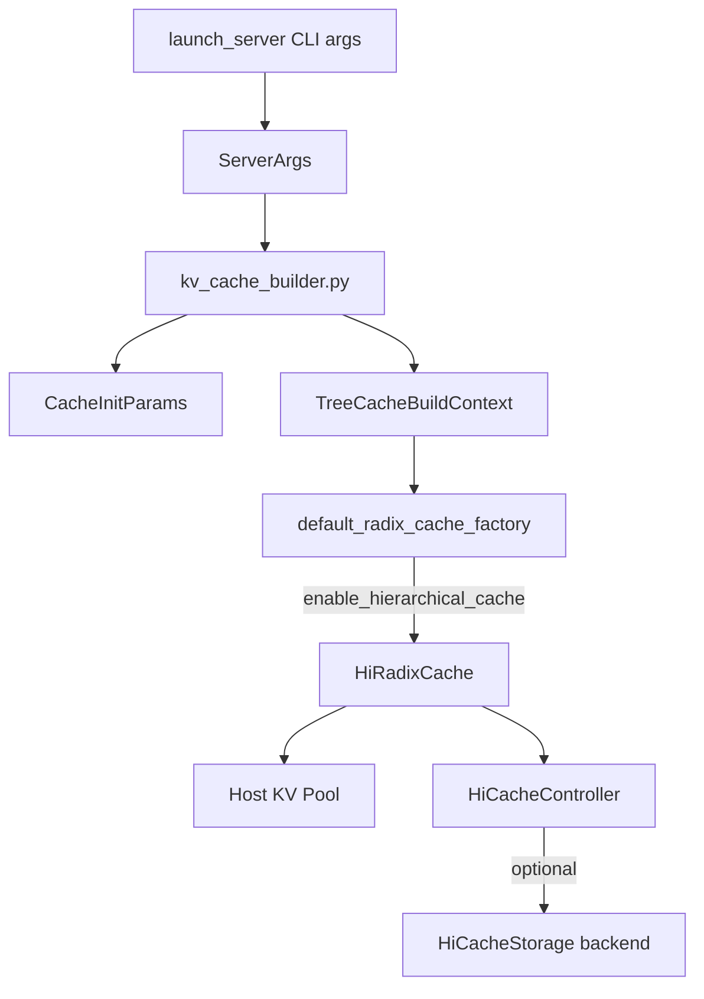
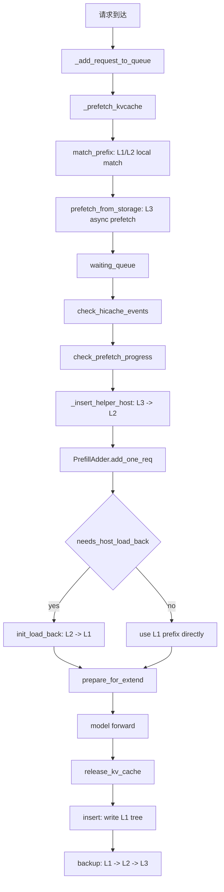

# SGLang 多级 PrefixCache 关键调用链

## 1. 启动与缓存实例创建



核心链路：

```text
launch_server
  -> ServerArgs
  -> kv_cache_builder.build_cache
  -> create_tree_cache(TreeCacheBuildContext)
  -> registry.default_radix_cache_factory
  -> HiRadixCache(params, server_args)
  -> HiCacheController(...)
```

关键判断：

- `ctx.enable_hierarchical_cache == True` 时，普通 attention 使用 `HiRadixCache`。
- hybrid SWA/SSM 模型会走 `UnifiedRadixCache`，但内部仍会初始化 HiCache 能力。
- `server_args.hicache_storage_backend is not None` 时，`HiCacheController` 会 attach L3 Storage backend。

## 2. 请求入队前：L1/L2 匹配和 L3 预取

请求进入 waiting queue 前，调度器会先尝试做 L3 预取。这一步不会阻塞完整 prefill，而是让后续排队时间变成 L3 IO 的隐藏窗口。

```text
Scheduler._add_request_to_queue
  -> Scheduler._prefetch_kvcache
  -> Req.init_next_round_input
  -> HiRadixCache.match_prefix
  -> HiRadixCache.prefetch_from_storage
  -> HiCacheController.prefetch
  -> prefetch_thread_func
  -> _storage_hit_query
  -> _page_transfer
```

对应源码：

- `sglang/python/sglang/srt/managers/scheduler.py:2156`
- `sglang/python/sglang/srt/managers/schedule_batch.py:1071`
- `sglang/python/sglang/srt/mem_cache/hiradix_cache.py:1438`
- `sglang/python/sglang/srt/mem_cache/hiradix_cache.py:1471`
- `sglang/python/sglang/srt/managers/cache_controller.py:910`
- `sglang/python/sglang/srt/managers/cache_controller.py:1064`

`match_prefix` 的结果重点看四个字段：

| 字段 | 含义 |
| --- | --- |
| `device_indices` | L1 GPU 命中的 KV block，可直接作为 prefix |
| `last_device_node` | 最后一个 GPU 仍可用的 RadixTree 节点 |
| `last_host_node` | 最后一个 Host 有备份的节点 |
| `host_hit_length` | L2 Host 命中的 token 数，后续需要 load back |

## 3. L3 Storage prefetch 完成后写入 Host 树

后台线程会先查询 L3 命中的 page 数，再把命中 page 拉到 Host KV 池。调度器在构造 prefill batch 前会轮询 prefetch 进度。

```text
Scheduler._get_new_batch_prefill_raw
  -> HiRadixCache.check_hicache_events
  -> HiRadixCache.check_prefetch_progress(req.rid)
  -> HiCacheController.terminate_prefetch
  -> HiRadixCache._insert_helper_host
  -> TreeNode.host_value = fetched host indices
```

核心点：

- L3 prefetch 以 page 为粒度。
- 多卡场景下会对完成 token 数取 `MIN`，保证各 worker 的可用前缀一致。
- 从 L3 拉到 Host 后，会用 `_insert_helper_host` 插入为 Host-only 节点。
- `loaded_from_storage` 会记录到 `prefetch_loaded_tokens_by_reqid`，供后续统计或调度使用。

## 4. Prefill 前：Host 命中回填 GPU

如果 L1 没有完整命中，但 L2 Host 上有备份，调度器会在真正加入 prefill batch 前回填 GPU。

```text
PrefillAdder.add_one_req
  -> req.needs_host_load_back()
  -> tree_cache.init_load_back
  -> HiRadixCache.load_back
  -> HiCacheController.load
  -> tree_cache.ready_to_load_host_cache
  -> HiCacheController.start_loading
  -> new_batch.prepare_for_extend
```

对应源码：

- `sglang/python/sglang/srt/managers/schedule_policy.py:931`
- `sglang/python/sglang/srt/managers/schedule_batch.py:1011`
- `sglang/python/sglang/srt/mem_cache/hiradix_cache.py:1141`
- `sglang/python/sglang/srt/mem_cache/hiradix_cache.py:1213`
- `sglang/python/sglang/srt/managers/scheduler.py:2795`

回填策略：

- `load_back` 会从命中节点向上收集连续的 evicted but backuped 节点。
- 如果回填 token 太少，小于 `load_back_threshold`，会跳过。
- 如果 GPU KV 空间不够，会先触发 `evict`，再尝试 load。
- 成功后会把节点的 `value` 设置为新的 GPU KV indices，并把 `prefix_indices` 拼接给请求。

## 5. 请求结束或阶段性缓存：GPU 写入树

请求完成后，SGLang 会把可缓存的 KV 写回 PrefixCache。HiCache 继承了 RadixCache 的请求级缓存入口，但重写了 `insert`，因此会额外处理 Host/L3 备份。

```text
release_kv_cache
  -> tree_cache.cache_finished_req
  -> HiRadixCache.insert
  -> TreeNode.value = GPU indices
  -> compute_node_hash_values
  -> _inc_hit_count
  -> write_backup
```

未完成请求或 chunked prefill 也可能通过 `maybe_cache_unfinished_req` 进入 `cache_unfinished_req`。

对应源码：

- `sglang/python/sglang/srt/mem_cache/common.py:57`
- `sglang/python/sglang/srt/mem_cache/hiradix_cache.py:1630`
- `sglang/python/sglang/srt/mem_cache/radix_cache.py`

## 6. GPU 到 Host：write backup

写 Host 的触发由 `--hicache-write-policy` 控制。

```text
HiRadixCache.insert
  -> _inc_hit_count
  -> write_backup
  -> HiCacheController.write
  -> HiCacheController.start_writing
  -> ack_write_queue
  -> HiRadixCache.writing_check
```

三种策略的理解：

| 策略 | 行为倾向 | 适合场景 |
| --- | --- | --- |
| `write_through` | GPU 写树后尽快备份到 Host | 追求复用稳定，Host 内存充足 |
| `write_through_selective` | 命中达到阈值后再备份 | 想降低 Host 写流量 |
| `write_back` | 更偏延迟备份，常在淘汰或必要时处理 | 想减少写放大，但驱逐路径更关键 |

## 7. Host 到 Storage：L3 backup

启用 `--hicache-storage-backend` 后，Host KV page 可进一步写入 Storage。

```text
HiRadixCache write-back ack
  -> write_backup_storage
  -> HiCacheController.write_storage
  -> backup_queue
  -> backup_thread_func
  -> _page_backup
  -> HiCacheStorage.batch_set / batch_set_v1
```

核心点：

- L3 备份以 `hash_value` 为 key，以 KV page 为 value。
- 支持普通 batch set，也支持部分后端的 zero-copy page set。
- Storage 后端由 `StorageBackendFactory` 创建，包括 `file`、`mooncake`、`hf3fs`、`nixl`、`aibrix` 和 `dynamic`。

## 8. 淘汰与多级缓存的关系

多级缓存里的淘汰不是简单删除，而是优先把 GPU 节点降级成 Host-backed 节点：

```text
GPU pressure
  -> HiRadixCache.evict
  -> choose evictable leaves
  -> if node.backuped
       free node.value from GPU
       keep node.host_value
     else
       write backup or remove depending policy
```

理解方式：

- L1 evict 后，节点可以继续作为 L2 hit。
- L2 evict 后，如果有 L3，仍可能通过 hash 从 Storage prefetch。
- L3 查询不是直接从 tree 中判断，而是在 prefetch 阶段通过 `batch_exists` 查后端。

## 9. 后台事件轮询

调度主循环会周期性调用 `check_hicache_events`：

```text
Scheduler._get_new_batch_prefill_raw
  -> tree_cache.check_hicache_events
  -> writing_check
  -> loading_check
  -> drain prefetch/backup queues
  -> reap async storage work
```

作用：

- 处理 Host/GPU load ack。
- 处理 GPU/Host write ack。
- 回收 Host 内存。
- 更新 Storage prefetch/backup 状态。
- 上报 storage metrics。

## 10. 一次请求完整链路总览


