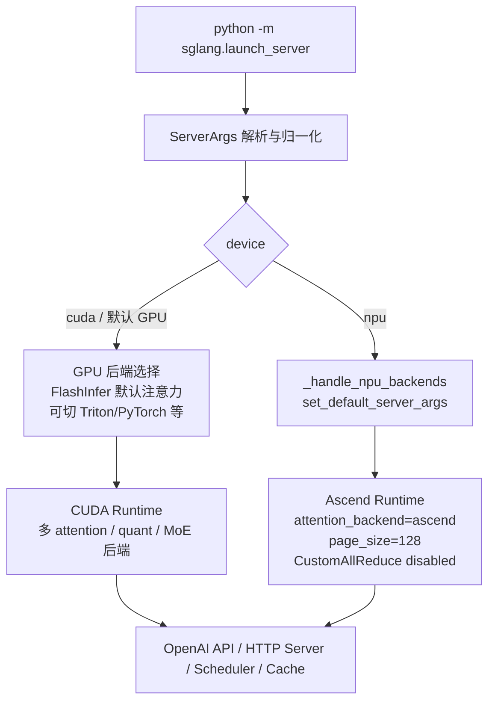

# 上层能力特性差异

分析时间：`2026-06-13 19:38:25 CST`

## 对比口径

- NPU：当前项目中的 Ascend NPU 路径，主要参考 `sglang/docs_new/docs/hardware-platforms/ascend-npus/`、`sglang/python/sglang/srt/hardware_backend/npu/` 与 `sgl-kernel-npu/`。
- GPU：当前项目中的主流 NVIDIA CUDA 路径，主要参考 `sglang/docs_new/docs/get-started/`、`server_args.py`、`attention_registry.py` 与通用 CUDA 后端源码。
- 本文更关注能力边界和调用链差异，不把性能优劣作为结论，除非源码或文档中明确体现。

## 一张图看上层分叉



## 启动入口差异

GPU 与 NPU 都走 SGLang 的统一 CLI，但最佳实践参数不同。

GPU 常规启动更偏向默认 CUDA 栈。官方安装文档说明 FlashInfer 是默认 attention kernel backend，遇到 FlashInfer 相关问题时可切到 Triton + PyTorch sampling。

```bash
python -m sglang.launch_server \
  --model-path /models/deepseek \
  --host 0.0.0.0 \
  --port 30000 \
  --tp 8 \
  --attention-backend flashinfer

# FlashInfer 不适配或排障时的保守回退
python -m sglang.launch_server \
  --model-path /models/deepseek \
  --host 0.0.0.0 \
  --port 30000 \
  --tp 8 \
  --attention-backend triton \
  --sampling-backend pytorch
```

NPU 启动需要先满足 Ascend 运行时组件版本和环境变量。NPU 支持文档中当前组件包括 HDK、CANN、torch_npu、Triton Ascend、SGLang NPU Kernel、MemFabric 等；Python 版本当前强调 `python==3.11`。

```bash
source /usr/local/Ascend/ascend-toolkit/set_env.sh

python -m sglang.launch_server \
  --model-path /models/deepseek \
  --device npu \
  --attention-backend ascend \
  --host 0.0.0.0 \
  --port 30000 \
  --tp 8 \
  --trust-remote-code
```

NPU 场景下，`--attention-backend ascend` 更像显式表达运行意图。源码里 `set_default_server_args` 会把 `attention_backend`、`prefill_attention_backend`、`decode_attention_backend` 都设置成 `ascend`，并按 NPU 显存设置默认 chunked prefill 和 decode graph batch size。

## 上层能力矩阵

| 维度 | GPU 场景 | NPU 场景 | 主要差异 |
| --- | --- | --- | --- |
| 安装与运行时 | 面向 NVIDIA CUDA，快速开始要求 Python 3.10+、CUDA GPU，安装文档说明 CUDA 13 默认镜像，也有 CUDA 12 镜像 | 面向 Ascend，绑定 CANN、torch_npu、Triton Ascend、sgl-kernel-npu、MemFabric、DeepEP-Ascend，当前文档强调 Python 3.11 | GPU 运行时依赖更通用；NPU 运行时依赖更强版本配套 |
| 注意力后端 | `flashinfer` 默认，可选 `triton`、`fa3`、`fa4`、`flashmla`、`cutlass_mla`、`trtllm_mha`、`trtllm_mla` 等 | `ascend` 为主，NPU 默认会覆盖 prefill/decode attention backend | GPU 是多后端矩阵；NPU 是 Ascend 专用后端 |
| Sampling | `flashinfer`、`pytorch` 等 | `pytorch`、`ascend` | NPU 支持 Ascend sampling，但选择面更窄 |
| 模型覆盖 | SGLang 通用模型体系，通常默认以 CUDA 路径最成熟 | NPU 文档维护了 Ascend 支持模型清单，覆盖 DeepSeek、Qwen、Llama、GLM、InternLM、Gemma、Mistral 等多类模型 | NPU 是显式适配与验证清单，迁移新模型更需要看 NPU support guide |
| 量化 | 选择很多，包括 AWQ、GPTQ、Marlin、FP8、MXFP8、FP4、MXFP4、ModelOpt、NVFP4、W8A8 等 | `modelslim` 是 NPU 专属入口；NPU quant path 还使用 `torch.ops.npu.npu_quant_matmul`、`npu_grouped_matmul`、`npu_dynamic_quant` 等 | GPU 量化生态更宽；NPU 量化更依赖 ModelSlim、torch_npu 算子和硬件格式 |
| GGUF | 作为通用 quant/load format 路径存在 | NPU 文档说明 GGUF 在加载时会先在 CPU 上反量化到 FP16/BF16，再转到 NPU；MoE 层再走 NPU grouped matmul/routing | NPU 上 GGUF 更像兼容加载路径，不等同于端到端低比特执行 |
| LoRA | 后端可选 `triton`、`csgmv`、`torch_native` 等 | 后端包含 `ascend`，底层有 `sgmv_expand`、`sgmv_shrink` 等 NPU 自定义 kernel | 上层都支持 LoRA；底层融合 kernel 不同 |
| 专家并行 MoE | MoE runner 可选 DeepGEMM、FlashInfer、CUTLASS、Triton、Marlin 等；A2A 可选 deepep、mooncake、nixl、flashinfer、megamoe 等 | NPU 支持 `ascend_fuseep`、DeepEP-Ascend、HCCS/RDMA/AllToAll；文档中部分 GPU 专属参数仍标为 Special for GPU | GPU 后端选择更多；NPU 有 Ascend 专用 EP 通信与 fused MoE 路径 |
| 投机解码 | 支持多种 GPU attention/acceptance 相关参数；文档中 acceptance threshold 标为 GPU 专属 | NPU 支持 EAGLE3、NEXTN、draft attention backend=`ascend`，speculative MoE A2A backend=`ascend_fuseep` | 算法入口一致，但 NPU 对 draft quantization、A2A backend 有更强约束 |
| HiCache / 多级缓存 | 通用 hierarchical cache，GPU 侧可使用 CUDA KV transfer kernel、Mooncake/NIXL 等生态 | NPU 支持 hierarchical cache，开启后默认 `hicache_io_backend=kernel_ascend`，MLA 时使用 `page_first_kv_split` 布局 | 同样支持多级缓存，但 NPU KV 搬运与 layout 是 Ascend 专用 |
| PD disaggregation | 默认/常见 transfer backend 包括 mooncake、nixl 等，GPU 有 IB device 等参数 | NPU 支持 `--disaggregation-transfer-backend ascend`，并依赖 MemFabric-Hybrid 替代 Mooncake Transfer Engine | 上层模式一致；底层传输后端和网络栈不同 |
| 图执行 | CUDA Graph 是 GPU 路径中的成熟优化手段 | NPU 使用 `torch.npu.NPUGraph`，源码会限制 prefill graph compiler 为 `eager`，并有 NPU graph runner | 概念类似，兼容性和 capture 约束不同 |
| 多模态 | GPU 通用 VLM/多模态能力更成熟 | NPU 有 Qwen-VL、GLM4.6V processor、`mm-attention-backend=ascend_attn` 等路径 | NPU 已有明确多模态入口，但需要看具体模型适配 |
| Linear attention / Mamba | GPU 选择 `triton`、`flashinfer`、`cutedsl` 等 | NPU 有 Ascend GDN、Hybrid Linear Attention、Mamba2 backend，但 NPU 支持矩阵中提示 mamba cache 当前不支持 | NPU 已在补齐线性注意力 kernel，但 cache 能力仍有差异 |

## 关键调用链

### GPU 通用后端选择

```text
launch_server
  -> sglang/python/sglang/srt/server_args.py
     -> ATTENTION_BACKEND_CHOICES
     -> SAMPLING_BACKEND_CHOICES
  -> sglang/python/sglang/srt/layers/attention/attention_registry.py
     -> flashinfer / triton / fa3 / fa4 / flashmla / cutlass_mla / trtllm_*
  -> sglang/python/sglang/srt/layers/quantization/
     -> fp8 / mxfp4 / awq / gptq / marlin / modelopt / w8a8_*
```

### NPU Ascend 后端选择

```text
launch_server --device npu
  -> sglang/python/sglang/srt/server_args.py
     -> _handle_npu_backends()
  -> sglang/python/sglang/srt/hardware_backend/npu/utils.py
     -> set_default_server_args()
     -> init_npu_backend()
  -> sglang/python/sglang/srt/hardware_backend/npu/
     -> attention / graph_runner / quantization / moe / allocator
  -> sgl-kernel-npu/
     -> torch.ops.npu custom ops
```

## 核心代码示例

NPU 场景的第一个关键动作，是在 server args 阶段注入 Ascend 默认值：

```python
def _handle_npu_backends(self):
    if self.device == "npu":
        from sglang.srt.hardware_backend.npu.utils import set_default_server_args

        set_default_server_args(self)

        current = self.cuda_graph_config.prefill.tc_compiler
        if current is not None and current != "eager":
            logger.warning(
                "At this moment Ascend platform only support prefill graph compilation with "
                "cuda_graph_config[prefill].tc_compiler='eager'."
            )
            self.cuda_graph_config.prefill.tc_compiler = "eager"
```

对应的 NPU 默认参数设置如下：

```python
def set_default_server_args(args: "ServerArgs"):
    # NPU only works with "ascend" attention backend for now
    args.attention_backend = "ascend"
    args.prefill_attention_backend = "ascend"
    args.decode_attention_backend = "ascend"
    if args.page_size is None:
        args.page_size = 128

    # NPU does not support CustomAllReduce
    args.disable_custom_all_reduce = True

    if args.enable_hierarchical_cache:
        args.hicache_io_backend = "kernel_ascend"
        if args.use_mla_backend():
            args.hicache_mem_layout = "page_first_kv_split"
        else:
            args.hicache_mem_layout = "page_first_direct"
```

后端枚举展示了 GPU 与 NPU 的形态差异：GPU 有大量 NVIDIA-specific attention backend，NPU 则作为 Other platforms 中的 `ascend` 接入。

```python
ATTENTION_BACKEND_CHOICES = [
    "triton",
    "torch_native",
    "flex_attention",
    "dsa",
    "dsv4",
    "cutlass_mla",
    "fa3",
    "fa4",
    "flashinfer",
    "flashmla",
    "trtllm_mla",
    "cutedsl_mla",
    "tokenspeed_mla",
    "trtllm_mha",
    "dual_chunk_flash_attn",
    "ascend",
]
```

## 场景化建议

### 如果目标是快速验证模型可跑

- GPU：优先默认安装和默认 attention backend；遇到 FlashInfer 问题再切 `--attention-backend triton --sampling-backend pytorch`。
- NPU：先确认 CANN、torch_npu、Triton Ascend、sgl-kernel-npu、MemFabric 版本；启动时显式带 `--device npu --attention-backend ascend`，便于日志和排障。

### 如果目标是 DeepSeek/MoE 性能调优

- GPU：重点看 MoE runner、FP8/FP4 runner、DeepGEMM、FlashInfer/CUTLASS/TRTLLM 后端选择。
- NPU：重点看 `ascend_fuseep`、DeepEP-Ascend、`npu_grouped_matmul`、`npu_moe_*` routing/finalize、ModelSlim 量化格式和 NZ format。

### 如果目标是长上下文和 PrefixCache/HiCache

- GPU：重点看 KV cache memory pool、CUDA transfer kernel、Mooncake/NIXL 等传输后端。
- NPU：开启 hierarchical cache 后注意 `kernel_ascend`、`page_first_kv_split`/`page_first_direct` 布局，以及 `transfer_kv_dim_exchange`。

## 已知边界

- NPU 支持矩阵中部分能力标记为 `Planned` 或 `Special for GPU`，例如部分 batch overlap 参数、speculative acceptance threshold、部分 DeepEP/FlashInfer 参数。
- NPU hierarchical cache 文档中明确提示当前不支持 mamba cache。
- NPU 的 “CUDA Graph” 命名来自 SGLang 通用参数体系，实际底层是 `torch.npu.NPUGraph`，不能直接按 NVIDIA CUDA Graph 的兼容性理解。
