# 底层算子能力差异

分析时间：`2026-06-13 19:38:25 CST`

## 总览

NPU/GPU 的底层差异，本质是两套 kernel 生态的差异。GPU 侧强调 CUDA 上的高性能通用后端组合，NPU 侧强调 Ascend 原生算子、CANN 格式、`torch_npu` 和 `sgl-kernel-npu` 自定义扩展。

```mermaid
flowchart TB
    Feature["SGLang 上层特性"] --> Attention["Attention / MLA"]
    Feature --> Moe["MoE / EP"]
    Feature --> Cache["KV Cache / HiCache"]
    Feature --> Quant["Quant GEMM"]
    Feature --> Spec["Speculative Decode"]
    Feature --> Lora["LoRA"]

    Attention --> GAttn["GPU\nFlashInfer / Triton / FlashAttention / CUTLASS / TRTLLM"]
    Attention --> NAttn["NPU\nAscendAttnBackend / npu_fused_infer_attention_score / mla_preprocess"]

    Moe --> GMoe["GPU\nDeepGEMM / FlashInfer / CUTLASS / Triton / Marlin"]
    Moe --> NMoe["NPU\nnpu_moe_* / npu_grouped_matmul / DeepEP-Ascend"]

    Cache --> GCache["GPU\nCUDA KV transfer / Mooncake / NIXL"]
    Cache --> NCache["NPU\nalloc_extend / transfer_kv_dim_exchange / kernel_ascend"]

    Quant --> GQuant["GPU\nFP8 / FP4 / MXFP4 / AWQ / GPTQ / ModelOpt"]
    Quant --> NQuant["NPU\nModelSlim / npu_quant_matmul / NZ format"]

    Spec --> GSpec["GPU\nCUDA tree/cache kernels"]
    Spec --> NSpec["NPU\nbuild_tree_kernel_efficient / verify_tree_greedy"]

    Lora --> GLora["GPU\nTriton / csgmv / torch_native"]
    Lora --> NLora["NPU\nbgmv / sgmv / sgemmv custom ops"]
```



## 底层能力对比表

| 能力 | GPU 底层路径 | NPU 底层路径 | 差异判断 |
| --- | --- | --- | --- |
| Decode/Paged Attention | `flashinfer_backend.py`、`triton_backend.py`、`flashattention_backend.py`、`cutlass_mla_backend.py`、`trtllm_*` | `hardware_backend/npu/attention/ascend_backend.py` 调 `torch.ops.npu.npu_fused_infer_attention_score`，另有 `sgl_kernel_npu.attention.decode_attention` | GPU 多后端可按模型和硬件选择；NPU 统一走 Ascend attention 体系 |
| MLA 预处理 | GPU MLA 后端分散在 FlashInfer/CUTLASS/TRTLLM/FlashMLA 等路径 | `hardware_backend/npu/attention/mla_preprocess.py` 调 `torch.ops.npu.mla_preprocess`，C++ 注册在 `sgl-kernel-npu/csrc/pytorch_extensions.cpp` | NPU 对 DeepSeek MLA 的 RMSNorm、dequant、matmul、RoPE、reshapeAndCache 做融合 |
| MoE routing 和专家计算 | `layers/moe/`、DeepGEMM、FlashInfer、CUTLASS、Triton、Marlin 等 | `hardware_backend/npu/quantization/fused_moe_method_npu.py` 调 `npu_moe_init_routing*`、`npu_grouped_matmul`、`npu_moe_finalize_routing` | GPU 后端选择丰富；NPU 依赖 Ascend 原生 MoE 算子与 grouped matmul |
| Expert Parallel 通信 | DeepEP、Mooncake、NIXL、FlashInfer、MegaMoE 等 | DeepEP-Ascend，支持 Normal/Low-Latency 模式，支持 HCCS、RDMA、AllToAll | NPU 有专用通信实现，参数和环境变量体系与 GPU DeepEP 不完全一致 |
| KV page 分配 | 通用 `PagedTokenToKVPoolAllocator` 与 CUDA 相关 cache kernel | `NPUPagedTokenToKVPoolAllocator` 小页面数走 `sgl_kernel_npu.mem_cache.allocator.alloc_extend_kernel` | NPU 对 page allocation 做 Ascend kernel 加速，并默认 page size 128 |
| KV cache H2D/D2H | GPU 路径使用 `sgl_kernel.kvcacheio` 等 CUDA transfer 能力 | `transfer_kv_dim_exchange` 注册到 `torch.ops.npu`，HiCache backend 默认 `kernel_ascend` | 传输 layout 和 kernel 完全不同 |
| 量化线性层 | FP8、FP4、MXFP4、AWQ、GPTQ、Marlin、ModelOpt 等 CUDA kernel | `linear_method_npu.py` 调 `npu_quantize`、`npu_dynamic_quant`、`npu_quant_matmul`、`npu_convert_weight_to_int4pack` | NPU 更依赖 torch_npu quant matmul 和 CANN/NZ format |
| 激活与 Norm 融合 | GPU 通常依赖 Triton/CUDA fused kernel | `sgl_kernel_npu.norm.*`、`activation.swiglu_quant`、`activation.swiglu_oai`、`npu_swiglu` | NPU 对 QKV split、RMSNorm、RoPE、SwiGLU 进行了 Ascend 专用融合 |
| LoRA | `triton`、`csgmv`、`torch_native` | `bgmv_expand/shrink`、`sgmv_expand/shrink`、`sgemmv_expand/shrink`、`sgemmc_expand/shrink` | 上层 LoRA 概念一致，底层矩阵小批处理 kernel 不同 |
| 投机解码树构造 | GPU 路径多使用 CUDA/Triton speculative ops | `build_tree_kernel_efficient`、`cache_loc_update`、`verify_tree_greedy` | NPU 有专用 tree build 和验证 kernel，但部分 tree mask mode 尚未实现 |
| Grammar token mask | GPU 可走通用 xgrammar/torch 或 CUDA 路径 | `apply_token_bitmask` 注册为 NPU custom op | NPU 对 logits bitmask 有专用算子 |
| Linear attention / GDN / Mamba | `triton`、`flashinfer`、`cutedsl`、Blackwell 特定组合 | `ascend_gdn_backend.py`、`ascend_hybrid_linear_attn_backend.py`、`recurrent_gated_delta_rule`、`mega_chunk_gdn`、`causal_conv1d` | NPU 已有专用线性注意力和 Mamba2 相关 kernel，但 mamba cache 支持仍有限 |
| 稀疏/索引类算子 | GPU DSA/NSA/HiSparse 等 CUDA kernel | `lightning_indexer`、`triangular_inverse`、`catlass_matmul_basic` 等 | NPU 侧补充了特定模型和注意力模式的辅助算子 |

## NPU 自定义算子清单

`sgl-kernel-npu/csrc/pytorch_extensions.cpp` 中通过 `TORCH_LIBRARY_FRAGMENT(npu, m)` 注册了 SGLang NPU 自定义算子。按场景可以分为：

| 场景 | 代表算子 | 能力 |
| --- | --- | --- |
| KV cache/page 分配 | `alloc_extend`、`cache_loc_assign`、`cache_loc_update`、`assign_cache_op` | 分配 extend 阶段 token 到 KV page，更新 cache location |
| MLA/Attention | `mla_preprocess`、`batch_matmul_transpose`、`transfer_kv_dim_exchange` | 融合 MLA 输入处理、批量 matmul transpose、KV 维度交换传输 |
| LoRA | `bgmv_expand`、`bgmv_shrink`、`sgmv_expand`、`sgmv_shrink`、`sgemmv_expand`、`sgemmv_shrink`、`sgemmc_expand`、`sgemmc_shrink` | 小批量 LoRA expand/shrink GEMV/GEMM |
| 投机解码 | `build_tree_kernel_efficient`、`cache_loc_update`、`verify_tree_greedy` | 构建 EAGLE/NEXTN draft token 验证树，更新 cache loc，贪心验证 |
| Linear attention | `recurrent_gated_delta_rule`、`mega_chunk_gdn`、`causal_conv1d_update`、`causal_conv1d` | GDN、Mamba、causal conv1d 相关计算 |
| Grammar/Logits mask | `apply_token_bitmask` | 将 token bitmask 应用到 logits |
| 辅助矩阵/索引 | `triangular_inverse`、`lightning_indexer`、`catlass_matmul_basic` | 三角矩阵求逆、Top-k 位置索引、基础 matmul |

## 关键调用链

### NPU Attention/MLA

```text
sglang/python/sglang/srt/layers/attention/attention_registry.py
  -> create_ascend_backend()
  -> sglang/python/sglang/srt/hardware_backend/npu/attention/ascend_backend.py
     -> torch.ops.npu.npu_fused_infer_attention_score(...)

DeepSeek MLA 预处理：
sglang/python/sglang/srt/hardware_backend/npu/attention/mla_preprocess.py
  -> torch.ops.npu.mla_preprocess(...)
  -> sgl-kernel-npu/csrc/pytorch_extensions.cpp
  -> sgl-kernel-npu/csrc/mla_preprocess/
```

### NPU MoE/量化

```text
sglang/python/sglang/srt/hardware_backend/npu/quantization/fused_moe_method_npu.py
  -> torch.ops.npu.npu_moe_init_routing_v2(...)
  -> torch.ops.npu.npu_dynamic_quant(...)
  -> torch.ops.npu.npu_grouped_matmul(...)
  -> torch.ops.npu.npu_swiglu(...)
  -> torch.ops.npu.npu_moe_finalize_routing(...)

sglang/python/sglang/srt/hardware_backend/npu/quantization/linear_method_npu.py
  -> torch.ops.npu.npu_quantize(...)
  -> torch.ops.npu.npu_quant_matmul(...)
  -> torch.ops.npu.npu_convert_weight_to_int4pack(...)
```

### NPU HiCache/KV cache

```text
--enable-hierarchical-cache
  -> set_default_server_args()
     -> hicache_io_backend = "kernel_ascend"
     -> hicache_mem_layout = "page_first_kv_split" or "page_first_direct"
  -> sglang/python/sglang/srt/hardware_backend/npu/allocator_npu.py
     -> sgl_kernel_npu.mem_cache.allocator.alloc_extend_kernel
  -> sglang/python/sglang/srt/mem_cache/memory_pool_host.py
     -> sgl_kernel_npu.kvcacheio.transfer_kv_dim_exchange
```

### GPU 多后端

```text
sglang/python/sglang/srt/layers/attention/attention_registry.py
  -> flashinfer_backend.py
  -> triton_backend.py
  -> flashattention_backend.py
  -> flashmla_backend.py
  -> cutlass_mla_backend.py
  -> trtllm_mha_backend.py / trtllm_mla_backend.py

sglang/python/sglang/srt/layers/quantization/
  -> fp8.py / mxfp4.py / nvfp4_online.py
  -> awq / gptq / marlin utils
  -> modelopt_quant.py
```

## 核心代码示例

NPU 自定义算子注册入口：

```cpp
TORCH_LIBRARY_FRAGMENT(npu, m)
{
    m.def("alloc_extend(Tensor pre_lens, Tensor seq_lens, Tensor last_loc, Tensor free_pages, int page_size, "
          "Tensor(a!) out_indices, Tensor(b!) values) -> ()");

    m.def("build_tree_kernel_efficient(Tensor parent_list, Tensor selected_index, Tensor verified_seq_len, "
          "Tensor tree_mask, Tensor positions, Tensor retrive_index, Tensor retrive_next_token, "
          "Tensor retrive_next_sibling, int topk, int depth, int draft_token_num, int tree_mask_mode)->()");

    m.def("mla_preprocess(Tensor hiddenState, Tensor gamma0, Tensor beta0, Tensor wdqkv, "
          "Tensor descale0, Tensor gamma1, Tensor beta1, Tensor wuq, "
          "Tensor descale1, Tensor gamma2, Tensor cos, Tensor sin, Tensor wuk,"
          "Tensor kv_cache, Tensor kv_cache_rope, Tensor slotmapping, "
          "Tensor quant_scale0, Tensor quant_offset0, Tensor bias0, "
          "Tensor quant_scale1, Tensor quant_offset1, Tensor bias1, *, "
          "Tensor? ctkv_scale=None, Tensor? q_nope_scale=None, "
          "str? cache_mode=None, str? quant_mode=None, "
          "Tensor(a!) q_out0, Tensor(b!) kv_cache_out0, Tensor(c!) q_out1, Tensor(d!) kv_cache_out1) "
          "-> (Tensor(a!), Tensor(b!), Tensor(c!), Tensor(d!))");
}
```

NPU KV page allocation 在小规模 extend page 数时走 `sgl-kernel-npu`：

```python
if num_new_pages_item < 200:
    from sgl_kernel_npu.mem_cache.allocator import alloc_extend_kernel

    out_indices = torch.empty(
        (extend_num_tokens,),
        dtype=torch.int64,
        device=self.device,
    )
    alloc_extend_kernel[(bs,)](
        prefix_lens,
        seq_lens,
        last_loc,
        self.free_pages,
        out_indices,
        next_power_of_2(bs),
        self.page_size,
        max_num_extend_tokens,
    )
else:
    alloc_extend_naive(...)
```

DeepSeek MLA 预处理在 NPU 上调用 fused op：

```python
torch.ops.npu.mla_preprocess(
    hidden_states,
    self.dummy,
    self.dummy,
    self.qkv_a_proj_weight_nz,
    self.qkv_a_proj_deq_scale_kvq,
    self.q_a_layernorm.weight,
    q_a_layernorm_bias,
    self.q_b_proj_weight_nz,
    self.q_b_proj_deq_scale,
    self.kv_a_layernorm.weight,
    cos,
    sin,
    ...
)
```

NPU MoE/量化路径大量使用 Ascend 原生算子：

```python
hidden_states, pertoken_scale = torch.ops.npu.npu_dynamic_quant(hidden_states)
hidden_states = torch.ops.npu.npu_grouped_matmul(...)
hidden_states = torch.ops.npu.npu_swiglu(hidden_states)
final_hidden_states = torch.ops.npu.npu_moe_finalize_routing(...)
```

## 能力差异的根因

1. GPU 后端大量复用 CUDA 生态成熟库，所以同一个 SGLang 特性通常有多个 kernel 实现可选。
2. NPU 后端为了获得性能，必须更贴近 Ascend 的内存格式、图执行约束和通信拓扑，例如 FRACTAL_NZ、CANN 算子、torch_npu、MemFabric。
3. NPU 不是简单复刻 GPU kernel，而是将关键路径重新融合到 Ascend 专用算子里，例如 MLA preprocess、NPU grouped matmul、DeepEP-Ascend、KV dim exchange。
4. 因为底层算子不同，上层同名参数不一定拥有完全相同的可用值、兼容性或性能语义。
