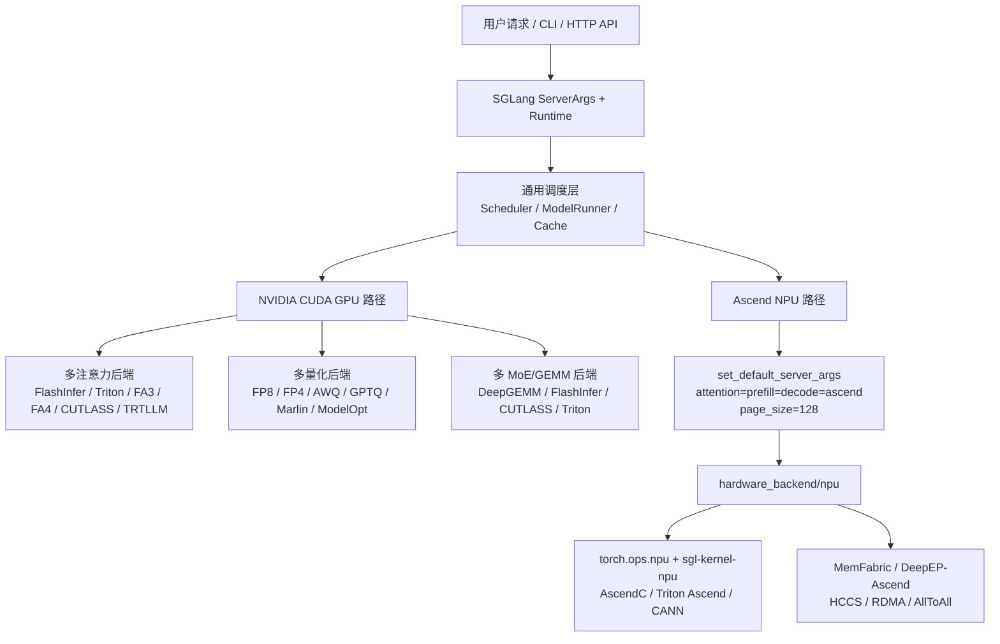

# NPU/GPU 能力差异分析

分析时间：`2026-06-13 19:38:25 CST`

归档标识：`npu_gpu_feature_diff_20260613_193825`

## 范围

本文档比较当前项目中 SGLang 的 Ascend NPU 场景与主流 NVIDIA CUDA GPU 场景。上层能力以 SGLang server 参数、官方平台文档、模型/推理特性为主；底层能力以注意力、MoE、KV cache、量化、LoRA、投机解码和线性注意力相关算子为主。

这里的 GPU 场景默认指 SGLang 的 NVIDIA CUDA 路径，不展开 AMD、Intel XPU、TPU 等其他平台。

## 快速结论

- NPU 与 GPU 在 API 层和服务入口上尽量保持一致，都走 `python -m sglang.launch_server`、HTTP/OpenAI API、scheduler、model runner 等上层框架。
- GPU 路径是更通用的多后端矩阵，核心特点是 FlashInfer、Triton、FlashAttention、CUTLASS、TensorRT-LLM、DeepGEMM 等后端可组合。
- NPU 路径是更收敛的 Ascend 专用栈，核心特点是 `--device npu` 后进入 `hardware_backend/npu`，默认注意力后端被设置为 `ascend`，再下沉到 `torch_npu`、CANN 与 `sgl-kernel-npu`。
- NPU 已覆盖服务、量化、LoRA、专家并行、投机解码、HiCache、PD 分离、部分多模态与线性注意力能力，但很多能力有 A2/A3/A5、CANN、torch_npu、MemFabric、DeepEP-Ascend 等版本和硬件约束。
- 底层算子差异不是“同一算子换设备运行”，而是两套后端生态：GPU 多依赖 CUDA kernel 与第三方高性能库，NPU 多依赖 `torch.ops.npu`、AscendC/Triton Ascend 自定义算子和 CANN 原语。

## 文档索引

| 文档 | 内容 |
| --- | --- |
| [01_upper_level_feature_diff.md](01_upper_level_feature_diff.md) | 上层能力特性差异：启动、后端选择、量化、LoRA、MoE、HiCache、PD、图执行、多模态等 |
| [02_operator_capability_diff.md](02_operator_capability_diff.md) | 底层算子能力差异：注意力、MLA、MoE、KV cache、量化 GEMM、LoRA、投机解码、线性注意力等 |
| [03_source_map.md](03_source_map.md) | 核心源码地图、继续追踪命令和验证记录 |

## 推荐阅读顺序

1. 先读 `01_upper_level_feature_diff.md`，建立 NPU/GPU 的产品能力边界。
2. 再读 `02_operator_capability_diff.md`，理解为什么同一个上层特性在 NPU/GPU 上会落到不同 kernel 体系。
3. 最后读 `03_source_map.md`，按源码路径继续深入具体模块。

## 核心架构图

## 验证记录

- 已读取 SGLang NPU 官方支持矩阵文档、NVIDIA GPU 安装/快速开始文档。
- 已检查 `server_args.py` 中后端选择、量化选择、MoE/LoRA/HiCache 参数枚举。
- 已检查 `hardware_backend/npu`、`sgl-kernel-npu/csrc/pytorch_extensions.cpp`、`sgl-kernel-npu/python/sgl_kernel_npu` 的核心算子注册和调用点。
- 本次为静态源码与文档分析，未在真实 GPU/NPU 硬件上启动服务或跑性能验证。
