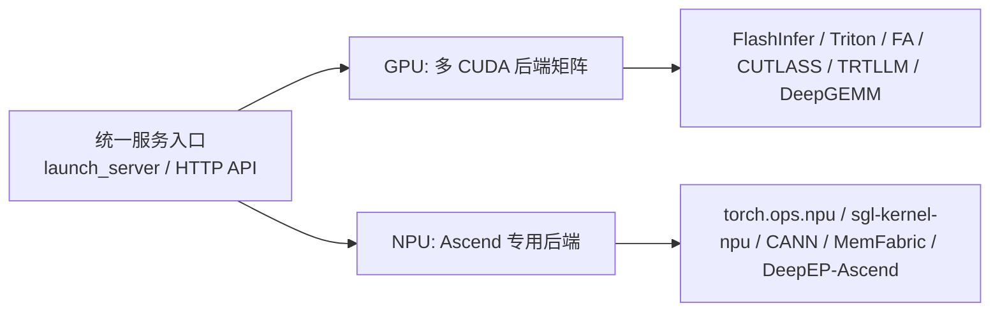

# NPU/GPU 能力差异分析

分析时间：`2026-06-13 19:38:25 CST`

归档标识：`npu_gpu_feature_diff_20260613_193825`

## 结论摘要

SGLang 的 NPU/GPU 差异可以分成两层理解：上层入口和 API 尽量统一，底层后端和算子生态明显分叉。GPU 路径以 CUDA 生态中的 FlashInfer、Triton、FlashAttention、CUTLASS、TensorRT-LLM、DeepGEMM 等多后端组合为主；NPU 路径进入 `hardware_backend/npu` 后，会把注意力默认收敛到 `ascend`，并依赖 `torch_npu`、CANN、`sgl-kernel-npu`、MemFabric 和 DeepEP-Ascend。

## 阅读入口

| 文档 | 内容 |
| --- | --- |
| [上层能力差异](npu_gpu_feature_diff_20260613_193825/01_upper_level_feature_diff) | 启动、后端、模型、量化、LoRA、MoE、HiCache、PD、图执行、多模态 |
| [底层算子差异](npu_gpu_feature_diff_20260613_193825/02_operator_capability_diff) | 注意力、MLA、MoE、KV cache、量化 GEMM、LoRA、投机解码、线性注意力 |
| [源码地图](npu_gpu_feature_diff_20260613_193825/03_source_map) | 关键源码路径、继续追踪命令和验证记录 |

